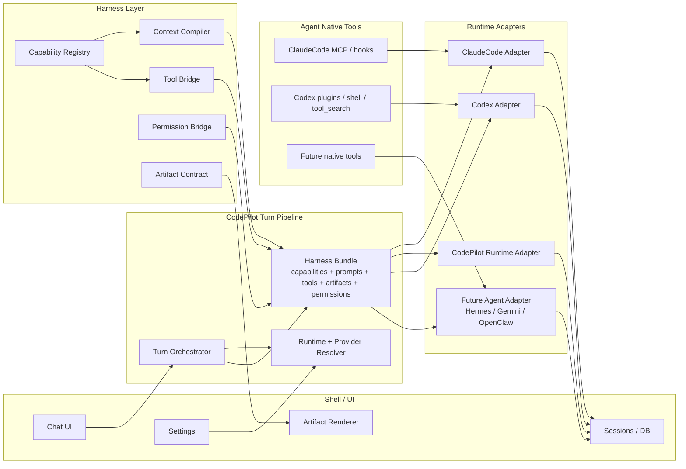

# Phase 5e — Runtime Harness Architecture / Agent 框架接入总线

> 创建：2026-05-17
> 状态：✅ 已完成并归档（2026-05-18）。Phase 0-6 均已落地：HarnessBundle 三层、Runtime/Provider/Capability matrix、Settings 能力清单、Native 基础盘 parity、mutationLevel 权限分级、工具不支持小字提示、Codex SDK coverage 调研与 New Runtime Playbook 收口全部完成。最新收口：CodePilot Native `assistant_buddy` parity 已补齐，Settings 中 ClaudeCode / CodePilot Native 均为 8/8，Codex 仍对不支持能力诚实降级。
> 验证：`npm run test` 2870/2870 pass；`PORT=3001 PLAYWRIGHT_BASE_URL=http://localhost:3001 npm run test:smoke` 14/14 pass（2026-05-18）。CDP smoke 已验证 Settings → 执行引擎能力 Dialog、trust badges、provider note 与 trigger 不误切 Runtime。
> 关系：承接 [Phase 5d Harness Capability Contract](../active/phase-5d-harness-capability-contract.md)，但比 Phase 5d Phase 6 更高一层。Phase 5d Phase 6 子计划（[phase-5d-phase-6-codex-account-harness.md](../active/phase-5d-phase-6-codex-account-harness.md)）正式归入 Phase 5e Phase 3 实施 slice，详见下文"Phase 3"段落的"承接说明"。
> 用户主线诉求（2026-05-17 用户原话，置顶以防漂移）：
>
> 1. CodePilot 成为用户自定义 Harness 和本地 Agent 框架的**集中地**。用户能在 CodePilot 这边挂自己的 MCP / Skills，**也包括感知**用户在 ClaudeCode / Codex / 其他框架里**自己**挂的 MCP / Skills / CLI / 内置 Memory；这些外部框架的自定义内容应该**跨框架可感知**。
> 2. **CodePilot 自己的 Runtime（Native Runtime）是产品底线，必须做到最完整**。其他 Agent 框架（ClaudeCode SDK / Codex）是接入来的，能接多少接多少；对方协议没开放的能力**就不假装能接**——在 Settings 页当前 Runtime 卡片下方给一份能力清单，逐项说明支持 / 不支持，让用户在选 Runtime 前就清楚边界。

## 协作契约

这份文档是 Codex 和 ClaudeCode 的共同上下文，不是只给实现者看的任务清单。

- Codex 负责：事实审计、计划制定、方案取舍、review、文档修正。除非用户明确要求，Codex 不直接改业务代码。
- ClaudeCode 负责：按计划执行代码实现、补测试、跑验证、交付结果。
- ClaudeCode 交付时必须写出：用户问题、讨论过程、关键判断、被否掉的方案和原因、改动、验证、防回归。不能只给结论。
- Codex 给 ClaudeCode 的执行口径必须共享判断过程。尤其是 Runtime / Provider / Harness / Permission / Artifact 相关任务，不能把复杂讨论压缩成“改 X 文件”。

## 当前问题

Codex 接入持续三天是不正常的。根因不是 Codex 单点难接，而是我们原先以为 Runtime 重构已经完成了三层解耦：

1. 壳：聊天 UI、设置、会话、权限、Artifact 渲染。
2. Agent 框架：ClaudeCode / Native / Codex / 未来 Hermes。
3. CodePilot 新加能力：Widget、Memory、Tasks、Media、Dashboard、用户自定义 Harness。

但真实代码里，这三层仍有很多交叉：

- Harness 能力散在 ClaudeCode MCP、Native AI SDK tools、Codex proxy bridge、system prompt、artifact parser 里。
- Provider 路径会影响 Harness 是否存在。例如 `codex_account` 走 Codex 原生 app-server，不经过 CodePilot proxy bridge；GLM/Kimi 走 `codepilot_proxy`，才有部分 CodePilot bridge tools。
- 模型能不能调用 Widget / Image / Dashboard，不只取决于 prompt，还取决于 Runtime 是否真的 mount 了对应工具，以及工具结果是否能回到 UI。
- Dashboard 仍是 deferred 能力，但用户和模型看不出“当前 Runtime 下不可用”，于是模型会猜错工具名或退回 shell/file。

用户的目标不是“让 Codex 勉强能聊”，而是：

> CodePilot 成为用户自定义 Harness 和本地 Agent 框架的集中地。用户可以接入本地各种 Agent 框架自带工具，也可以接入 CodePilot / 用户自己的 Harness 内容，并且这些能力尽可能跨框架可感知、可调用、可渲染。

## 术语边界

| 名词 | 定义 | 例子 | 不能混淆为 |
|---|---|---|---|
| Shell | CodePilot 桌面壳，负责 UI、会话、设置、权限、Artifact、DB | Chat UI、PreviewPanel、Settings | Agent 框架 |
| Runtime | 一个 Agent 执行框架，定义 turn、tool、permission、session、event 协议 | ClaudeCode SDK、CodePilot Runtime、Codex app-server | 模型服务商 |
| Provider / Backend | 模型来源或账号来源 | Codex Account、OpenAI-compatible、Anthropic-compatible、CodePlan | Runtime |
| Harness | 注入给 Agent 的能力层。**包含三类，见下方"Harness 三层"** | Memory、Widget、Dashboard、Tasks、custom MCP、Skills、用户在外部框架挂的 MCP/CLI | Runtime native tools |
| Runtime Native Capability | Agent 框架自己带的、CodePilot 不 own 也不重定义的能力 | Codex shell/tool_search/plugins、ClaudeCode 自带 hooks | CodePilot Harness |
| Artifact Contract | 工具或模型输出到 UI 的结构化表现层 | show-widget、MediaBlock、DiffSummary、inline-html | 任意文本 |

### Harness 三层（2026-05-17 ClaudeCode 补充，对齐用户主线诉求）

Harness 不是单一来源。按"谁拥有 + 注入意图"分成三层：

| 子层 | 定义 | 例子 | 当前承载方式 |
|---|---|---|---|
| Built-in Harness | CodePilot 默认 ship 的能力 | Widget / Memory / Tasks / Image / Media / Dashboard / CLI tools | `src/lib/harness/capability-contract.ts` |
| User CodePilot Harness | 用户**在 CodePilot 这边**挂的能力 | Settings 里加的 MCP server / 自定义 Skill / 自定义 slash command / project CLAUDE.md | 部分已存在（plugins / mcp-loader），但**未在 capability-contract 中登记** |
| External Framework Harness | 用户**在外部 Agent 框架**自己挂的能力 | 用户 `~/.claude/` 下的 ClaudeCode MCP / Skills / Memory；`~/.codex/` 下的 Codex plugins / CLI；未来 Hermes 的 user 配置 | Phase 5e 已建立 `ExternalFrameworkHarnessRef` + scanner；执行仍按 Runtime 协议能力诚实降级 |

**"跨框架可感知"的硬定义**（用户原话延伸）：

- 用户在 ClaudeCode `~/.claude/mcp.json` 挂了一个 MCP server → 用户切到 Codex Runtime 跟 CodePilot Chat 对话时，模型应至少**知道**这个 MCP 存在（即便不能直接调）；UI 设置页能列出来。
- 用户在 ClaudeCode 写了 `~/.claude/CLAUDE.md` → 切到其他 Runtime 时，相关上下文应被合理注入（视 token budget）。
- 反向同理：用户在 Codex 那边挂的 plugin / CLI，切到 ClaudeCode Runtime 时也要被感知。

"感知" ≠ "执行"。执行需要 Runtime 协议真支持；感知只要求**告知模型 + UI 列出**，不让模型在某 Runtime 下假装能调一个其实调不到的 MCP。

### 核心原则（扩展自 Codex 草案 + ClaudeCode 补充）

1. **Provider 只决定模型从哪里来；Runtime 决定 Agent 协议怎么跑；Harness 决定能力怎么被看见、调用、回传、渲染。**
2. **Provider 不应该决定 Harness 是否存在。**
3. **Harness 三层都要走同一份 HarnessBundle。** Built-in / User CodePilot / External Framework 必须在同一个 Bundle 里编译完成；不允许"Built-in 走 Harness Layer，外部框架走 ad-hoc loader"。
4. **External Framework Harness 的感知是必须项，执行是尽力而为。** 跨框架调用某些工具可能技术上不可行（例如 ClaudeCode-only 的 hook 在 Codex 里跑不起来），但**让模型和 UI 知道这些工具存在**永远应该做到。
5. **CodePilot 自己的 Runtime（Native Runtime）是产品底线，必须做到最完整。** 用户底线是"我们要尽自己的努力，把我们自己这边的 Runtime 做好"。其他 Runtime 是接入来的：
   - 对方协议开放能接的能力，按 Harness manifest 接；
   - 对方协议**没开放**的能力，**就不假装能接**——不在 prompt 里诱导模型瞎用、不放宽 parser 兼容、不读对方 auth 文件绕过协议；
   - 不能接的部分必须**在 Settings 页当前 Runtime 卡片下方明示**："本 Runtime 支持 / 不支持哪些 CodePilot 能力 + 不支持的原因"。
   - 任何 "Native Runtime 没有 X 但其他 Runtime 有 X" 的差距应该视为 Native Runtime 的待补功能，不是合理边界。

## 理想架构



理想状态下，一次用户发送消息的流程是：

1. Shell 收到用户 turn。
2. Turn Orchestrator 解析 session、workspace、runtime pin、provider、权限 profile。
3. Harness Layer 生成同一份 `HarnessBundle`：可用能力、不可用原因、system/developer fragments、tool schemas、artifact contracts、permission policy、memory fragments。
4. Runtime Adapter 只把 `HarnessBundle` 转换成对应 Agent 框架的协议。
5. Runtime native tools 可以保留，但要作为“Agent native capability”显式登记，不能和 CodePilot Harness 混成一团。
6. 所有输出转回 canonical run events + artifact contracts，由 Shell 渲染。

## 现在已经做得比较好的解耦

| 层 | 已完成 | 证据 |
|---|---|---|
| Runtime id / selector | `claude_code` / `codepilot_runtime` / `codex_runtime` 已统一到 `RuntimeId` | `src/lib/runtime/runtime-id.ts` |
| Session ref | 每个 Runtime 可以保存自己的 opaque session/thread ref | `src/lib/runtime/session-store.ts` |
| Canonical events | 多数 Runtime 输出已经映射到统一 run event | `src/lib/runtime/contract.ts` |
| Context Compiler | Phase 5d 已把多处 prompt 拼接收敛到 compiler / adapter facade | `src/lib/harness/context-compiler.ts`、`src/lib/harness/runtime-adapter.ts` |
| Capability catalog | Widget / Memory / Tasks / Image / Media / Dashboard / CLI 已入册 | `src/lib/harness/capability-contract.ts` |
| Artifact registry | Widget / media / markdown / html / diff / json / table / error 已有 contract | `src/lib/harness/artifact-contract.ts` |
| Provider proxy bridge | Codex proxy 路径已经有 Responses 解析、工具桥、SSE、media import | `src/lib/codex/proxy/*` |

## 仍未做到位的地方

| 缺口 | 现象 | 为什么严重 |
|---|---|---|
| Provider path 影响 Harness | `codex_account` 原生路径绕过 `codepilot_proxy`，而 GLM/Kimi 路径走 proxy bridge | 同一个 Codex Runtime 下，不同 provider 的 CodePilot 能力不同，用户无法理解 |
| Runtime native tools 与 Harness 未统一建模 | Codex shell/tool_search/plugins 能跑，但 CodePilot Widget/Dashboard 不一定可调 | 模型会在没有 CodePilot 工具时退回 shell/file，制造错误过程 |
| Capability availability 不够细 | Dashboard 是 deferred，但 chat composer / prompt 没明确告诉用户和模型 | 用户让模型“固定到看板”，模型猜不存在的工具名 |
| Tool invocation 没有单一总线 | ClaudeCode 是 MCP，Native 是 AI SDK tools，Codex proxy 是 bridge tools，Codex Account 是 native tools | 新接 Hermes 可能再写第四套 |
| Permission contract 未完全统一 | Codex approval bridge 仍出现 duplicate id / 409 类问题 | 写操作和 dashboard pin 这类能力无法可靠跨 Runtime |
| Artifact 能渲染不等于工具可调用 | show-widget parser 能识别 fence，但如果模型没拿到正确工具/规则，仍输出 malformed | 不能用“放宽 parser”掩盖 Harness 未注入 |
| Smoke matrix 维度不够 | 之前按 Runtime 或 provider 粗测，漏了 Codex Account native path | 下次接新框架也会漏路径 |

## 为什么 ClaudeCode / Native 稳，Codex 不稳

ClaudeCode 稳，不是因为 prompt 更神奇，而是因为它有真实 MCP 承载：

- Widget 原设计是 MCP：模型调用 `codepilot_load_widget_guidelines`，拿到规范，再输出 `show-widget` fence。
- Memory / Tasks / Media 也有 MCP server 或明确 tool surface。
- ClaudeCode 的工具协议和模型执行路径是一体的，模型看到的工具就是真的工具。

Native 稳，是因为 CodePilot 自己掌控 AI SDK `ToolSet`：

- 内置工具由 `getBuiltinTools()` mount。
- 工具调用、结果、media、artifact 都在同一个进程里。
- prompt 和 tool schema 可以同步调整。

Codex 不稳，是因为 Codex 被接成了两条路：

| 路径 | 当前行为 |
|---|---|
| Codex Account / GPT-5.5 | 走 Codex app-server 原生路径；Codex native shell/file/tool_search 能跑；CodePilot bridge tools 不在工具面上 |
| GLM/Kimi/OpenAI-compatible via Codex Runtime | 走 CodePilot `/api/codex/proxy/v1/responses`；部分 CodePilot bridge tools 能跑；还要翻译 Responses / tool / SSE |

所以问题不是“Codex 模型不听话”，而是我们没有让它在每条 backend 路径上都拿到同一份 Harness。

## 架构原则

1. **每个 CodePilot Chat turn 必须经过 Harness Bundle**
   - 不允许某个 provider path 因为是官方账号就绕过 Harness。
   - 如果确实无法承载某能力，必须在 bundle 中显式声明 unavailable。

2. **Runtime Adapter 只能 adapt，不能 redefine**
   - 不能在 adapter 里重新写 widget prompt、media prompt、memory prompt。
   - adapter 只能把 compiler 输出转换成 MCP / AI SDK ToolSet / Responses proxy / native instructions。

3. **Runtime Native Capability 要登记，但不等于 CodePilot Harness**
   - Codex shell/tool_search/plugins 是 Codex native capability。
   - CodePilot Widget/Dashboard/Memory 是 Harness capability。
   - 两者可以同时存在，但必须有冲突规则和 UI 可见性。

4. **工具可见性必须等于工具可调用性**
   - 如果模型看到 `codepilot_dashboard_pin`，那 runtime path 必须真的能执行。
   - 如果不能执行，不要用 prompt 暗示它能做；UI 也要显示不可用原因。

5. **Artifact 是类型化结果，不是救火 parser**
   - Widget fence、MediaBlock、DiffSummary、inline HTML 都要有 contract。
   - 不要用“接受更多 malformed 格式”来掩盖模型没拿到协议。

6. **Permission 是跨 Runtime contract**
   - dashboard pin/remove、file write、shell、task scheduling 都要有统一 permission policy。
   - Runtime native approval 要映射进 CodePilot permission UI，不能各走各的。

7. **新 Agent 接入先做 matrix，不先写 bridge**
   - 先列 native tools、provider backends、tool schema、permission、artifact、resume、stream events。
   - 没有 matrix，不开工。

## 执行计划

| Phase | 内容 | 状态 | 用户可验收结果 |
|---|---|---|---|
| Phase 0 | 事实锁定与协作同步 | ✅ 已完成 | Codex 和 ClaudeCode 对“Runtime / Provider / Harness”使用同一套定义 |
| Phase 0.5 | Native Runtime 基础盘审计 | ✅ 已完成 | CodePilot Native 已逐 capability 审计并完成 P0/P1/P2 收口；assistant_buddy parity 后为 8/8 |
| Phase 1 | Harness Bundle 边界定义 | ✅ 已完成 | 三层 HarnessBundle + User / External scanner + 强校验落地 |
| Phase 2 | Runtime × Provider × Capability matrix | ✅ 已完成 | Settings 能力清单从 capability contract / mutationLevel 派生，展示支持度与 trust / approval 边界 |
| Phase 3 | Codex Account native path 补齐或降级 | ✅ 已完成 | Codex Account / Codex proxy 不可执行能力在 Settings 与聊天工具结果下方诚实提示，不诱导模型瞎猜 |
| Phase 4 | Unified Tool Invocation Surface | ✅ 已完成 | CodePilot 内置工具通过 HarnessBundle / Runtime adapter / side-channel 统一建模；Native memory/tasks/media parity 已补齐 |
| Phase 5 | Permission + Artifact 收口 | ✅ 已完成 | `mutationLevel` 派生权限边界；媒体结果实时显示；不支持工具以小字提示替代弹窗 |
| Phase 6 | 新 Runtime Playbook 验收 | ✅ 已完成 | New Runtime Playbook 增加 Phase 5e checklist 和反模式；Hermes 类 Agent 接入前有硬性 checklist |

### Phase 0 — 事实锁定与协作同步

目标：先让 Codex 和 ClaudeCode 停止“各修各的症状”。

动作：

- 把本文加入 `docs/exec-plans/active/`，并在 exec-plans README 索引。
- ClaudeCode 继续实现前必须先引用本文的术语边界。
- Codex review 必须检查“这次改动是在补 Harness 架构，还是只是在补一个 prompt/string parser”。

完成准则：

- README active 索引能看到本文。
- 后续 ClaudeCode 交付摘要里必须出现：Runtime / Provider / Harness 三者边界。

### Phase 0.5 — Native Runtime 基础盘审计

目标：把用户已拍板的“CodePilot Native Runtime 是产品底线”变成可执行清单，而不是只停留在原则里。

动作：

- 对 Built-in Harness capability 逐项审计 Native Runtime：Widget / Memory / Tasks / Image / Media / Dashboard / CLI。
- 每项标记：`complete` / `partial` / `missing`。
- 任何 “Native 没有 X 但 ClaudeCode 或 Codex 有 X” 必须进入 backlog，不能作为“其他 Runtime 接入限制”合理化。
- 已知例子（**已闭环**，留作模板）：`expected-differences.ts` 在审计当日仍有 Native `image_generation` tool result shape follow_up；按 "Native 是产品底线" 原则视为待补而非合理边界——后续 Phase 5e P1 已通过 harness side-channel emit MediaBlock 关闭该 follow_up，ledger 清空。这条记录留作"如何对待 Native 缺口"的模板：发现 → 入 ledger → 优先级排序 → 实施关闭，不允许长期 follow_up。
- 审计阶段**只读**——产出 matrix + backlog + 优先级；P0/P1 实施由后续 slice 在审计共识达成后启动（已陆续落地，见决策日志）。

完成准则：

- Phase 2 matrix 中 Native 行不能只写 `live`，必须能追到逐 capability 的审计结果。
- 所有 Native `partial/missing` 都有 issue / tech-debt / follow_up 记录。
- 后续任何 Phase 推进不得让 Native 的 capability coverage 退化。

#### Phase 0.5 审计结果 — 2026-05-17

审计范围：只读代码与文档，不改业务实现。依据为 `src/lib/harness/capability-contract.ts`、Native 工具挂载点 `src/lib/builtin-tools/index.ts` / `src/lib/agent-tools.ts` / `src/lib/agent-loop.ts`，以及各 MCP authority 文件。

| Built-in capability | Native mount | 审计状态 | 证据 | 后续动作 |
|---|---|---|---|---|
| `widget` | `codepilot-widget-guidelines` group，`codepilot_load_widget_guidelines` | `complete` | Native 通过 `src/lib/builtin-tools/widget-guidelines.ts` 复用 canonical widget prompt；Widget artifact contract 已和 capability example byte-identical | 保持 smoke：Native 生成 show-widget fence 后必须能即时渲染 |
| `memory` | `codepilot-memory` group，`codepilot_memory_recent/search/get` | ✅ `complete`（2026-05-18 Phase 5e 主体已落地） | Native `codepilot_memory_search` 已真过滤 `tags` + `file_type`；`codepilot_memory_recent` 已对齐 authoritative `memory.md` + `memory/daily/` 布局，并保留 legacy 回退。 | 维持 runtime tests：tags / file_type / recent layout 不得回退。 |
| `tasks_and_notify` | `codepilot-notify` group，notify / schedule / list / cancel | ✅ `complete`（2026-05-18 Phase 5e 主体已落地） | Native `list_tasks` 已合并 durable + session-only tasks 并按 status 过滤；`cancel_task` 先查 session-only，再回退 durable DELETE；`schedule_task` 的 `durable=false` 保持 session-only。 | 维持 session-only runtime tests，防 camelCase/snake_case 与 durable-only 回归。 |
| `image_generation` | `codepilot-media` group，`codepilot_generate_image` | ✅ `complete`（2026-05-17 Phase 5e P1 已落地） | `builtin-tools/media.ts` 现在调 `emitBuiltinEvent` 把 `MediaBlock[]` 推到 harness side-channel（`@/lib/harness/builtin-event-bus`）；`agent-loop.ts` 订阅后把 media 拼进 `tool_result` SSE.media 字段；`expected-differences.ts` 对应 follow_up 已关闭 | 维持：image-gen smoke 必须有 MediaBlock 端到端渲染；新 media-shaped 工具按 emit-side-channel + return-plain-text 模板 |
| `media_import` | `codepilot-media` group，`codepilot_import_media` | ✅ `complete`（2026-05-17 Phase 5e P1 已落地） | 同上 — `importFileToLibrary` 结果构造 `MediaBlock`（用 `mediaTypeOf` 推 image/video/audio），同 side-channel 注入 | 维持：导入后 UI 实时展示媒体卡的 smoke 必须 deterministic |
| `dashboard` | `codepilot-dashboard` group，dashboard CRUD / pin tools | ✅ `complete`（2026-05-18 Settings/permission 收口） | Dashboard tools 已按 exposure.kind 在 ClaudeCode + CodePilot Native 显示 executable；`mutationLevel` 派生 trust boundary，list/refresh 为 safe read，pin/update/remove 需要批准；Codex 仍 perception_only。 | 维持 Settings 能力清单与 mutationLevel 派生一致。 |
| `cli_tools` | `codepilot-cli-tools` group，install / update / remove / list 等 | ✅ `complete`（2026-05-18 Settings/permission 收口） | 安全洞已堵：install/add/remove/update 等外部变更走 ask；list/check_updates 为 safe read；Settings 显示 trust boundary。Codex 仍 perception_only。 | 维持 mutationLevel 完整性测试；新 CLI tool 必须显式分级。 |
| `assistant_buddy` | `codepilot-notify` group，`codepilot_hatch_buddy` | ✅ `complete`（2026-05-18 round 8 已落地） | Native `createNotificationTools()` 已挂载 `codepilot_hatch_buddy`，`capabilityIdsForGroup('codepilot-notify')` 同时返回 `tasks_and_notify` + `assistant_buddy`，`assistant_buddy.exposure.native.kind = ai_sdk_tool`；CodePilot Native Settings 能力清单为 8/8。Codex 仍 `unsupported`，所以顶层 status 继续 `deferred`。 | 维持：Native notification group 若再新增跨 capability 工具，必须同步 group → capability map + adapter pin；Codex bridge 仍诚实降级。 |

Native-only 但尚未入 Built-in capability catalog 的工具组：

| Native group | 当前状态 | 处理建议 |
|---|---|---|
| `codepilot-session-search` | `src/lib/builtin-tools/index.ts` 直接挂载，属于会话检索工具，不在 capability contract | Phase 1 HarnessBundle 时决定是否作为 User/CodePilot Harness capability 入册 |
| `codepilot-ask-user` | Native 内部交互工具，不在 capability contract | Phase 5 Permission + Artifact 收口时决定是否单列为 ask-user artifact / permission flow |

优先级：

1. ✅ **P0 已落地（2026-05-17 ClaudeCode 止血 patch）**：不再把 `codepilot_*` 整体当成 safe tool。`src/lib/agent-tools.ts` 删除 `name.startsWith('codepilot_')` 一刀切，改成显式 `PERMISSION_SAFE_TOOLS` allowlist（14 条 read-only 工具 = 4 核心 Read/Glob/Grep/Skill + 10 codepilot read-only：memory_recent/search/get、load_widget_guidelines、list_tasks、dashboard_list/refresh、cli_tools_list/check_updates、session_search）。所有 mutating 工具（cli_tools_install/add/remove/update、notify、schedule_task、cancel_task、generate_image、import_media、dashboard_pin/update/remove、hatch_buddy）现在走 ask permission flow。新增 `agent-tools-permission-allowlist.test.ts`（35 pins，含后续 set-equality 加固）source-grep 禁止前缀回归 + 逐工具 rationale + 与 capability catalog 完整性 cross-check + 显式 allowlist size 对齐防静默扩张。范围严格克制：未重写 permission 架构，未引入 mutationLevel 抽象（留给 Phase 5 正式做）。
2. ✅ **assistant_buddy Native parity 已落地（最终收口 2026-05-18）**：先在 2026-05-17 修正 catalog drift，把不实的 Native exposure 降级为 `unsupported`；随后按用户"CodePilot Native 是基础盘"要求补齐 Native 工厂，`src/lib/builtin-tools/notification.ts` 挂载 `codepilot_hatch_buddy`，`src/lib/builtin-tools/index.ts` 的 `codepilot-notify` 同时映射 `tasks_and_notify` + `assistant_buddy`，`CAPABILITY_EXECUTABLE_RUNTIMES.assistant_buddy` 加入 `codepilot_runtime`。顶层 status 仍 `deferred`，因为 Codex bridge 尚未支持该能力；per-runtime matrix 已正确显示 ClaudeCode + CodePilot 可调用、Codex 感知降级。
3. ✅ **P1 已落地（2026-05-17 ClaudeCode Native MediaBlock 補齐）**：`builtin-tools/media.ts` 的 `codepilot_generate_image` / `codepilot_import_media` 现在通过 harness side-channel（`@/lib/harness/builtin-event-bus`——从 `codex/proxy/builtin-event-bus.ts` promotion 到 cross-runtime harness 位置）emit `MediaBlock[]`；`agent-loop.ts` 在流开始前 subscribe，按 `toolCallId` cache，case `'tool-result'` 时 splice 到 SSE `tool_result.media` 字段。Codex bridge / Native 两条路径现在 media 协议**完全一致**；`expected-differences.ts` 唯一剩余 follow_up（image_generation MediaBlock）已清。新增 `native-media-block-side-channel.test.ts`（16 pins，含 import_media 真实 PNG fixture 成功路径端到端测试）+ 既有 codex-builtin-bridge tests（仍绿）。`npm run test` 2695/2695。
4. ✅ **Native memory / tasks parity 已落地（2026-05-18 Phase 5e 主体）**：memory tags/file_type/recent layout、tasks session-only list/cancel 均有 runtime tests。
5. ✅ **mutationLevel 已落地（2026-05-18 Phase 5e 主体）**：`PERMISSION_SAFE_TOOLS` 从 `CODEPILOT_TOOL_MUTATION_LEVELS` 派生；未声明工具 fail-safe 走 ask。
6. ✅ **Settings 能力清单已落地（2026-05-18 round 6-8）**：Dialog 承载，显示可调用数量、用户语言说明、trust boundary、Codex Account provider note 与聊天内工具不支持小字提示。
7. **保留边界**：Codex bridge 仍不支持 dashboard / cli_tools / assistant_buddy / user MCP/Skills 的直接调用；这些在 Settings 与 tool-blocked hint 中诚实降级，不再作为 Phase 5e blocker。

ClaudeCode review 补充（2026-05-17）：

- 立即止血补丁不必等待 Phase 5e 大重构：把 `agent-tools.ts` 的 `name.startsWith('codepilot_')` 临时替换成显式 read-only allowlist。建议 allowlist 只包含 memory read、widget guidelines、session search、CLI list/check-updates、dashboard list、list_tasks 等无写入/无外部副作用工具；其余 `codepilot_*` 默认走 ask。这个补丁要带 regression test，防止一刀切前缀回归。
- 长期设计不要靠工具名前缀猜语义。Phase 5 Permission + Artifact 收口时，每个 CodePilot tool factory 需要显式声明：

```ts
type ToolMutationLevel =
  | 'safe_read'
  | 'mutating_local'
  | 'mutating_external'
  | 'side_effect';
```

  - `safe_read`：可跳权限，例如 memory search / load widget guidelines。
  - `mutating_local`：写本地 CodePilot 状态，例如 dashboard pin / schedule_task，应有弱权限或 session approve。
  - `mutating_external`：执行外部安装/卸载/shell，必须 ask。
  - `side_effect`：用户可感知副作用，例如 notify / hatch buddy，至少要 audit event；默认策略是否 ask 由 permission profile 决定。
- Phase 0.5 审计表本身要有 source-pin 测试。建议新增 `harness-native-audit.test.ts`：解析本节表格中的 `complete/partial/missing`，并用源码或 runtime check 验证证据仍然成立。修复某项能力时，测试应推动开发者同步更新审计表，而不是让 stale audit 长期存在。
- 需要补一张三方语义对比表（ClaudeCode SDK / Native / Codex proxy），但这不改变 Native 底线。目的不是要求每个 Runtime 都 100% 对齐 Native，而是区分“Native 单点落后”与“三方普遍 backlog”。

### Phase 1 — Harness Bundle 边界定义

目标：把一次 turn 的 CodePilot 能力包定义为可传递、可测试的边界。

建议类型（Codex 草案 + ClaudeCode 2026-05-17 补充 Harness 三层 + External Framework 感知）：

```ts
interface HarnessBundle {
  readonly runtimeId: RuntimeId;
  readonly providerId: string;
  // Built-in Harness — CodePilot ship 的能力（widget / memory / ...）
  readonly builtinCapabilities: readonly HarnessCapabilityMount[];
  // User CodePilot Harness — 用户在 CodePilot 这边挂的（Settings MCP / 自定义 Skill / slash / project CLAUDE.md）
  readonly userCapabilities: readonly UserHarnessExtension[];
  // External Framework Harness — 用户在外部框架挂的（~/.claude/* / ~/.codex/* / 未来 Hermes 用户配置）
  readonly externalExtensions: readonly ExternalFrameworkHarnessRef[];
  // 不可执行能力（声明 live 但当前 Runtime/Provider 路径上 mount 失败 / 协议不支持）
  readonly unavailableCapabilities: readonly HarnessCapabilityUnavailable[];
  readonly contextFragments: readonly CompiledContextFragment[];
  readonly toolSurfaces: readonly RuntimeToolSurface[];
  readonly artifactContracts: readonly ArtifactContractRef[];
  readonly permissionPolicy: HarnessPermissionPolicy;
  readonly nativeCapabilityHints: readonly RuntimeNativeCapabilityHint[];
}

interface UserHarnessExtension {
  readonly kind: 'mcp_server' | 'skill' | 'slash_command' | 'prompt_fragment' | 'workspace_rule';
  readonly origin: 'codepilot_settings' | 'project_file';   // CodePilot 这边的来源
  readonly id: string;
  readonly displayName: string;
  // executable: 当前 Runtime 是否能直接调；false 时只走 "感知" 通道
  readonly executable: boolean;
  readonly executableReason?: string;
}

interface ExternalFrameworkHarnessRef {
  // 外部框架的标识
  readonly framework: 'claude_code' | 'codex' | 'future';
  readonly kind: 'mcp_server' | 'skill' | 'cli' | 'memory' | 'plugin' | 'hook';
  // 用户在外部框架的配置文件 / 安装位置（fs path，CodePilot 只读）
  readonly origin: string;
  readonly id: string;
  readonly displayName: string;
  // 在当前 Runtime 下能否直接调用。Codex 里挂的 plugin 在 ClaudeCode 下大概率 false；
  // ClaudeCode MCP 在 Codex Runtime 下视协议而定。
  readonly executable: boolean;
  // false 时给模型的"感知"措辞（"用户在 ClaudeCode 里挂了 XX，但当前 Runtime 调不到，
  // 如需使用请切到 ClaudeCode Runtime"）。
  readonly perceptionHint?: string;
}
```

关键点：

- `providerId` 只能影响 backend-specific constraints，不能让 Harness 消失。
- Codex Account 如果不能 mount CodePilot tools，也必须产出 `unavailableCapabilities`。
- `nativeCapabilityHints` 用来告诉 UI / model：Codex shell/file/search 可用，但它不是 CodePilot Dashboard。
- **三层 Harness 共用同一个 Bundle**——`builtinCapabilities` / `userCapabilities` / `externalExtensions` 都在 Bundle 内编译完成；任何 Runtime adapter 拿到 Bundle 后**不允许**绕过任一层。
- **"感知"与"可执行"分离**：`executable: false` 的 extension 仍进 Bundle，但只走 perception 通道（写进 system prompt 让模型知道存在 + UI 列出 + 说明切到哪个 Runtime 可用），不进 toolSurfaces。

### 跨框架感知的实现切入点（ClaudeCode 2026-05-17 补充）

External Framework Harness 在每个 Runtime 启动 turn 之前必须被扫描 + 编译进 Bundle。**fixture-first**：

1. **ClaudeCode 用户配置扫描**（Phase 1 入口任务）
   - 来源文件：`~/.claude/mcp.json`、`~/.claude/CLAUDE.md`、`~/.claude/skills/`、`~/.claude/commands/`、project 级 `.claude/` 同套
   - 只读，不写。CodePilot 永远不修改用户在 ClaudeCode 里的配置文件。
   - 已有的部分实现：`src/lib/mcp-loader.ts` 已经会读 project `.mcp.json`（仅 ClaudeCode 路径用），扩展到所有 Runtime 即可。
2. **Codex 用户配置扫描**（Phase 1 入口任务）
   - 来源文件：`~/.codex/config.toml` / `~/.codex/plugins/` 等（具体路径 Phase 6a fixture-first 后确认）
   - 同样只读。
3. **Memory 跨框架**
   - ClaudeCode 内置 Memory 是 `~/.claude/CLAUDE.md` + Skills 内的 memory 文件
   - CodePilot 自己的 Memory 在 `assistant_workspace`
   - **不合并**——只在 Bundle 里同时列出，让模型知道有两套 Memory，不要混

### 已稳路径保护（ClaudeCode 2026-05-17 补充）

Phase 1 引入 `HarnessBundle` 是个**新数据类型**；Phase 4 Unified Tool Invocation Surface 是个**新抽象**。这意味着 ClaudeCode + Native 两条已经稳定的 Runtime 路径要重构。

**强制切换顺序**：

1. **Phase 1.0**：HarnessBundle 类型 + Context Compiler 输出适配——在 ClaudeCode + Native 上跑通，所有现有 harness contract test 仍绿。**Codex 路径暂不切**。
2. **Phase 1.1**：把 ClaudeCode + Native 的 `adaptForClaudeCode` / `adaptForNative` facade 改造为消费 HarnessBundle，外观仍兼容。
3. **Phase 2**：在 ClaudeCode + Native 验证完 Bundle 形态后，再让 Codex Runtime + proxy 路径适配。
4. **Phase 3**：最后才动 Codex Account 原生路径。

**禁止**：

- 不允许"先在 Codex 上试 HarnessBundle 形态"——会被 Codex 单点扭曲，Bundle 形态会被"恰好能解决 Codex 问题"驱动，后续 ClaudeCode / Native 适配时发现要改 Bundle 形状。
- 不允许在 HarnessBundle 抽象未稳定前就动 Codex Account 注入实现。

**完成准则**：

- Phase 1 落地时 ClaudeCode + Native + Codex proxy 三条路径都通过 HarnessBundle 接口，**所有 Phase 5d 的 harness-*.test.ts 全绿 + 新增 HarnessBundle 形态测试** ≥ 10 pins。

### Phase 2 — Runtime × Provider × Capability matrix

目标：别再漏 Codex Account 这类子路径。

矩阵维度（ClaudeCode 2026-05-17 补充 User CodePilot Harness + External Framework Harness 两列）：

| Runtime | Provider backend | Built-in Harness | User CodePilot Harness | External Framework Harness 可感知 | Agent native capability | 总体状态 |
|---|---|---|---|---|---|---|
| ClaudeCode | Claude account / SDK | MCP CodePilot tools 全 live | Settings MCP / Skills 直接 mount | Agent 侧可能原生读取；CodePilot inventory / UI 可见性仍待 Phase 1 实现 | ClaudeCode MCP/hooks | live（CodePilot 外部感知 partial） |
| CodePilot Runtime | DB provider / OAuth / env | AI SDK ToolSet 全 live | Settings MCP 通过 mcp-loader | 待 Phase 1.0 加 ClaudeCode 配置扫描 | none / CodePilot loop | live（外部感知 partial） |
| Codex Runtime | Codex Account | **当前完全缺 CodePilot bridge** | **当前完全缺** | **当前完全缺** | Codex shell/tool_search/plugins | partial（仅 Codex 原生） |
| Codex Runtime | OpenAI-compatible / GLM / Kimi via proxy | CodePilot bridge tools partial（dashboard deferred） | 当前**未感知** | **当前完全缺** | Codex passthrough tools limited | partial/live by capability |
| Future Hermes | TBD | TBD | TBD | TBD | Hermes native tools | must define before code |

完成准则：

- `capability-contract.ts` 或新文件能表达 provider backend 子维度。
- `codex_account` 不再被混在 `codex_proxy` 曝光字段里——必须独立维度。
- 所有 `live` 能力必须在每个声明为 live 的路径上真实 mount。
- **External Framework Harness 至少 ClaudeCode + Codex 用户配置在每个 Runtime 都能被列出**（即使不能执行，也要在 Bundle 的 `externalExtensions` 出现 + UI 设置页可见 + 模型 system prompt 含感知 hint）。
- **User CodePilot Harness 跨 Runtime 一致**：用户在 CodePilot Settings 里挂的 MCP / Skill / slash command，无论切到哪个 Runtime，都要在 Bundle 里出现（executable 字段反映实际能不能调）。

### Phase 3 — Codex Account native path 补齐或降级

#### 承接说明（ClaudeCode 2026-05-17）

[phase-5d-phase-6-codex-account-harness.md](../active/phase-5d-phase-6-codex-account-harness.md) 的所有子 slice（6a fixture-first → 6b matrix → 6c 注入方案 → 6d dashboard bridge → 6e UI 可见性）**正式归入本 Phase 3 实施 slice**。Phase 5d Phase 6 文档保留作为子任务 backlog，但状态汇报统一在 Phase 5e 这边。决策日志双写。

本计划补充更高层原则：

- 不要只给 Codex Account 追加 widget prompt。没有工具承载时，prompt 只能让格式稍好，不能让 Dashboard / Image / Memory 真可调。
- 不要把 raw HTML show-widget 当成"兼容格式"放行。这会掩盖模型没有拿到正确 widget contract。
- 如果 Codex app-server 没有第三方 tool mount 扩展点，就必须诚实降级：UI 显示"Codex Account 当前只支持 Codex 原生工具；CodePilot 内置能力请切到可桥接 provider"。

#### ✅ 用户已拍板的产品决策（2026-05-17）

**用户原话**：

> 如果说一部分能力我们无法接入，对方没开放，我们就可以在设置页面的当前引擎下面给它一个介绍，说明哪些能力我们支持，哪些能力不支持。如果我们确实接不进去，那就可以不接，直接告知用户。但是我们要尽自己的努力，把我们自己这边的 Runtime 做好。

**落地决策**（B 选项的更克制变体；A / C 都被否掉）：

- ❌ A（独立模式 / 移出主聊天页）——增加模式切换 UX 负担，且与"集中地"主线冲突。
- ✅ **B-Settings 变体**——Codex Account 保留在 Runtime / Provider 选择中，**但提示不放主聊天页顶部 banner**（会打扰常用 chat UX），改为**Settings 页当前 Runtime 卡片下方有一个"能力支持清单"区块**，按 capability 一条一条列：哪些 ✓ 支持 / 哪些 ✗ 不支持 / ✗ 时写明原因（"对方协议未开放 / 需切到 X Runtime 启用"）。
- ❌ C（禁掉 Codex Account）——违反"集中地"初衷，去掉用户可用的入口。

**配套底线**（用户原话延伸）：

> "把我们自己这边的 Runtime 做好" → **CodePilot Native Runtime 是产品基础盘**。任何能力，只要 Native 上没有，都视为待补，不能用"其他 Runtime 有就行"作为借口（已收入架构原则第 5 条）。

#### Settings 页能力清单的形态约束（ClaudeCode 2026-05-17）

避免后续讨论时漂走，固化以下约束：

- 位置：**Settings 页 → Runtime / Provider 卡片 → 卡片下方一个能力清单区块**。不是主聊天页顶部 banner，不是 modal，不是 toast。
- 形态：按 Harness capability 一条一条列（widget / memory / tasks / image / media / dashboard / cli + 用户自定义 / 外部框架感知）。每条显示：
  - 当前 Runtime 是否支持该 capability（✓ 支持 / ⚠️ 部分 / ✗ 不支持）
  - ✗ 时写一句**用户能理解的话**说明原因（不是技术 jargon）：例如"该 Runtime 协议未开放第三方工具挂载，无法调用 CodePilot Widget；如需 Widget 请切到 Native Runtime 或 ClaudeCode SDK"。
  - 给出可行替代路径（"切到 X Runtime 启用 X 能力"）。
  - trust / approval 边界：是否读文件、写本地 CodePilot 状态、执行外部命令、触发系统/远程通知，以及是否会请求用户批准。用户不能只看到"支持 Dashboard"，却不知道它会不会静默写入看板。
- 数据源：直接从 `capability-contract.ts` + Phase 1 `HarnessBundle` 派生，**不允许独立维护**。漂移就是 Bug。
- 不允许：
  - 假装能用（模型 prompt 仍诱导调不可用工具）
  - 在 chat 里反复提示（已经 Settings 里说过了）
  - 仅 chat UI 暴露而 Settings 里看不到（Settings 是用户决策前的入口，必须有）

#### 完成准则

- GPT-5.5 / Codex Account 下请求 Widget：
  - 要么正确渲染 show-widget（如果 Phase 6a 调研证明协议能接）；
  - 要么模型不假装能调 widget tool（直接说 "当前 Runtime 不支持，请切到 X"），且 **Settings 页该 Runtime 卡片下方该 capability 显示 ✗ + 替代路径**。
- 请求 Dashboard pin：
  - 要么真实 pin 成功；
  - 要么模型 + Settings 同步明确 dashboard capability unavailable + 替代路径。
- Settings 能力清单与 `capability-contract.ts` / `HarnessBundle` 一致——加测试 pin（不允许 Settings 文案与 catalog 漂移）。
- Settings 能力清单必须显示 trust / approval 边界，并从 tool semantic / permission policy 派生，不能用手写 copy 猜。
- Native Runtime 在所有 capability 上不能 partial：任何 "Native 没有 X 但其他 Runtime 有 X" 都列入 backlog，不当 "合理边界"。

此外，A/B/C 决策已经在文档中收口：实现必须走 B-Settings 变体，不允许文档说 B、代码做 A 或 C。

### Phase 4 — Unified Tool Invocation Surface

目标：CodePilot 内置工具跨 Runtime 的“调用、结果、UI 渲染”一致。

要统一的面：

- Tool schema 来源。
- Tool result shape。
- Media / artifact side-channel。
- Error result。
- Permission request。
- Session-only vs durable 行为。

重点能力：

- Widget：guidelines tool + show-widget artifact。
- Image generation：工具调用 + MediaBlock + import-to-library + live render。
- Memory：search/read/write 范围与 workspace gating。
- Tasks/Notify：durable/session-only/list/cancel parity。
- Dashboard：pin/list/update/remove/refresh。

完成准则：

- 每个 live capability 至少有一个 runtime-level semantic test，不只 source-grep。
- GLM/Kimi via Codex 调用 CodePilot image/widget/memory/tasks 不再需要靠手工 smoke 修一个补一个。

### Phase 5 — Permission + Artifact 收口

目标：工具结果不要“刷新聊天才出现”；写操作不要各 runtime 分裂。

必须覆盖：

- Codex approval bridge duplicate id / 409 要有 idempotent 行为。
- Tool-only turns 必须实时产生 assistant message。
- MediaBlock 必须导入可 serve 路径。
- Dashboard write 是否需要 permission，要有明确策略。
- Permission denied 后 Runtime 必须得到可理解结果，而不是挂住。

完成准则：

- deny / allow / timeout 三条路径都有测试。
- image/widget/dashboard tool-only turn 不切会话也能看到结果。

### Phase 6 — 新 Runtime Playbook 验收

目标：下次接 Hermes 不再重复 Codex 事故。

新 Runtime 接入前必须填：

1. Runtime 协议 schema snapshot。
2. Provider backend 列表。
3. Native tool list。
4. Harness capability matrix。
5. Tool invocation adapter。
6. Permission adapter。
7. Artifact adapter。
8. Resume/thread/session 语义。
9. Smoke matrix。

禁止：

- 不能先写 bridge 再靠 live smoke 找协议。
- 不能因为模型“看起来会”就不 mount tool。
- 不能把 provider 和 runtime 合成一个概念。

## Smoke Matrix

### 主路径（新场景）

| 场景 | 期望 |
|---|---|
| ClaudeCode + Widget | 通过 MCP guidelines 生成 show-widget，正常渲染 |
| Native + Widget | 通过 AI SDK tool / guidelines 生成 show-widget，正常渲染 |
| Codex Account + Widget | 可用或显式 unavailable；不能 malformed 后再试图 patch 文件 |
| Codex proxy GLM/Kimi + Widget | 通过 bridge 生成 show-widget，正常渲染 |
| Codex Account + Dashboard pin | 可用或显式 unavailable；不能猜 `show_widget` / shell fallback |
| Codex proxy GLM/Kimi + Dashboard pin | 如果 dashboard live，必须真实 pin；否则显式 unavailable |
| Image generation | tool result 带 MediaBlock，当前聊天实时显示，不靠切会话刷新 |
| Memory search | workspace gating / tags / file_type 语义一致 |
| Tasks/Notify | durable/session-only/list/cancel 语义一致 |
| Permission deny | UI deny 后 runtime 不挂死，不 409，不重复 permission id |

### 回归保护（ClaudeCode 2026-05-17 补充）

| 场景 | 期望 | 防什么 |
|---|---|---|
| Phase 5d harness-*.test.ts 全套 | 130+ pin 全绿（不允许任何 pin 被绕过 / 删除） | 防 Phase 5e 重构把 5d 守护拆掉 |
| ClaudeCode SDK 现有 widget 流（无 Phase 5e 改动接触前用户 smoke 过的） | 行为不变 | 防"为了让 Codex 通过"而扭曲 ClaudeCode 行为 |
| Native Runtime + 一个已存在的非 widget capability（如 tasks_and_notify） | 行为不变 | 防 HarnessBundle 引入时 Native 现有挂载方式被改坏 |
| Codex Runtime + GLM/Kimi 现有 image gen flow | MediaBlock 仍正常显示 | 防 Phase 3 改 Codex Account 时同时把 proxy 路径也碰坏 |
| `harness-runtime-adapter.test.ts` cross-runtime fragment byte-identity | widget / memory / tasks_and_notify / image_generation / media_import 在 ClaudeCode / Native / Codex proxy 三 Runtime 下编出的 capability fragment 仍字节相等 | 防 Bundle 引入让某 Runtime 的 fragment 漂移 |

### 用户自定义 / 跨框架感知（ClaudeCode 2026-05-17 补充）

| 场景 | 期望 |
|---|---|
| 用户在 CodePilot Settings 挂自定义 MCP server → 切到 ClaudeCode Runtime | Bundle.userCapabilities 列出，executable=true，模型能调 |
| 同上 → 切到 Codex Runtime + proxy | Bundle.userCapabilities 列出；executable 取决于 bridge 是否能 mount 同名 MCP；不能时 perceptionHint 写明"切回 ClaudeCode 可调" |
| 同上 → 切到 Codex Account | Bundle.userCapabilities 列出；executable=false（视 Phase 3 决策）；UI 列出 + 模型 prompt 含感知 |
| 用户在 `~/.claude/mcp.json` 自己挂的 MCP → 切到 ClaudeCode Runtime | externalExtensions 列出，executable=true |
| 同上 → 切到 Codex Runtime（任何 provider） | externalExtensions 列出，executable=false 时 perceptionHint 提示"该 MCP 是 ClaudeCode 用户配置，需切回 ClaudeCode Runtime 调用" |
| 用户 `~/.codex/` 下自己挂的 plugin → 切到 ClaudeCode Runtime | externalExtensions 列出，executable=false + perceptionHint |
| `~/.claude/CLAUDE.md` 内容 → 任意 Runtime 启动 turn | 相关上下文按 token budget 进入 contextFragments；模型能引用到 |

### 每个 Phase 的 acceptance test 锚点（ClaudeCode 2026-05-17 补充）

避免 "能跑就算完成"，每 Phase 至少有以下机器可验证项：

| Phase | Acceptance test 锚点 |
|---|---|
| Phase 0 | `docs/exec-plans/README.md` 含本文链接 + Codex review 必须 cite 本文术语段（review checklist 增项） |
| Phase 0.5 | Native Runtime capability audit 存在；每个 Built-in Harness capability 都有 `complete/partial/missing` 标记；partial/missing 必须有 follow_up |
| Phase 0.5 follow-up | `harness-native-audit.test.ts` 或等价测试存在：审计表状态与源码证据保持同步；修复 capability 时必须同步更新审计表 |
| Phase 1 | 新建 `harness-bundle.test.ts`：HarnessBundle 类型 round-trip / 三层 capability 各非空 / executable=false 时 perceptionHint 必须填 |
| Phase 2 | `capability-contract.ts` 扩展后 `harness-capability-contract.test.ts` 新增 provider backend 子维度 pin；`codex_account` 独立 exposure 字段 |
| Phase 3 | smoke matrix 中 "Codex Account + Widget / Dashboard" 两行任一必须有 deterministic 结果（pass 或显式 unavailable，不允许 "flaky 偶尔过"）；A/B/C 决策落代码 |
| Phase 4 | 每个 live capability 至少一个 runtime-level execute 测试（不是 source-grep）；执行→结果回流→UI artifact 渲染端到端 |
| Phase 5 | approval idempotency pin（已在 Phase 5d Phase 3 review fix 上线）+ tool-only turn 实时显示测试 + permission deny round-trip 测试 |
| Phase 6 | Hermes 接入前可填写的空白 checklist 文档存在；Phase 6 不开工实现，只验收 checklist 与本计划对齐 |

## 给 ClaudeCode 的下一步口径

不要把这个问题理解成“再补一条 Codex widget prompt”。这次真正的判断过程是：

1. 用户希望 CodePilot 是 Harness 和 Agent 框架的集中地，而不是某个 Runtime 的薄 UI。
2. ClaudeCode / Native 稳，是因为 CodePilot 能力有真实工具承载；Codex Account 不稳，是因为它走了原生路径，CodePilot bridge tools 根本不在工具面上。
3. Codex native shell/file/tool_search 可以保留，但它们不是 CodePilot Dashboard / Widget / Memory。
4. 如果某能力不能在某 provider backend 下执行，要显式 unavailable；不要让模型猜。
5. 实现前先更新 matrix 和 HarnessBundle 边界，再改代码。

优先顺序：

1. 先审现有 `phase-5d-phase-6-codex-account-harness.md`，确认它的 6a fixture-first 不和本文冲突。
2. 补 Runtime × Provider × Capability matrix。
3. 决定 Codex Account 是接入 bridge、注入 system-only partial，还是 UI 显式降级。
4. 再处理 Dashboard bridge / permission / UI visibility。

## 给 Codex review 的检查清单

- 这次改动有没有把 Runtime / Provider / Harness 混在一起？
- 有没有某个 provider path 绕过 HarnessBundle？
- 模型看到的工具是否真的可执行？
- `live` capability 是否在所有声明 live 的路径上都有真实 mount？
- Artifact parser 是否被用来掩盖上游工具缺失？
- Permission deny/allow 是否回到 Runtime，而不是只改 UI？
- 文档是否记录了被否掉方案和原因？

## 非目标

- 不马上接 Hermes。本文是为 Hermes 做接入框架，不是开始 Hermes 实现。
- 不重写 Codex provider proxy translator，除非 matrix 证明必须。
- 不关闭 Codex native tools。它们应作为 native capability 登记，而不是被禁用。
- 不通过读取用户 Codex auth 文件来绕过协议。
- 不为了通过一次 smoke 放宽 Widget parser。

## 决策日志

- 2026-05-17：新立 Phase 5e（Codex 起草）。Codex + ClaudeCode 需要共享 "Runtime / Provider / Harness" 边界；Phase 5d Phase 6 继续处理 Codex Account 具体补洞，本计划负责更上层架构和下一次 Runtime 接入方法。
- 2026-05-17（ClaudeCode 第一轮补充）：用户主线诉求扩展——Harness "集中地" 不只是 CodePilot 内置 + 用户在 CodePilot 这边挂的，还包含**用户在外部 Agent 框架自己挂的 MCP / Skills / CLI / 内置 Memory**，且**跨框架可感知**。具体补丁：
  - 术语：Harness 拆三层（Built-in / User CodePilot / External Framework），加 "跨框架感知" 硬定义（感知 ≠ 执行）
  - 类型：HarnessBundle 加 `userCapabilities` + `externalExtensions` 字段；每条 extension 带 `executable` + `perceptionHint`
  - Phase 1 入口：扫 ClaudeCode `~/.claude/*` + Codex `~/.codex/*` 用户配置，作为 External Framework Harness 进 Bundle
  - 切换顺序：Phase 1.0/1.1 先在 ClaudeCode + Native 验证 Bundle 形态，再 Codex proxy，最后 Codex Account。禁止 Codex 单点驱动 Bundle 设计
  - Phase 2 matrix：加 User CodePilot Harness + External Framework Harness 两列
  - Phase 3 接管：[phase-5d-phase-6-codex-account-harness.md](../active/phase-5d-phase-6-codex-account-harness.md) 子 slice 6a-6e 正式归入 Phase 5e Phase 3
  - Smoke matrix：加 "回归保护" 行（5d 130+ pin / 三 Runtime 老 flow / cross-runtime fragment byte-identity）+ "用户自定义 / 跨框架感知" 行
  - 每 Phase 加 acceptance test 锚点（防止 "能跑就算完成"）
- 2026-05-17（用户拍板，B-Settings 变体 + Native Runtime 底线）：用户对 Phase 3 A/B/C 决策点直接定案：
  - **不假装能接**：对方协议没开放的能力就不接，直接告知用户；不在 prompt 诱导模型瞎用 / 不放宽 parser / 不读对方 auth 文件绕过协议
  - **告知用户的形式 = Settings 页当前 Runtime 卡片下方的能力清单**（不是主聊天页 banner，不是 modal），按 capability 一条一条列支持/不支持 + 不支持原因 + 替代路径
  - **产品底线 = CodePilot Native Runtime 必须做到最完整**——任何"Native 没有 X 但别的 Runtime 有 X"都是 Native 待补功能，不是合理边界
  - 落地：架构原则新增第 5 条；Phase 3 完成准则从抽象的 "或可用或显式 unavailable" 升级为具体的"Settings 卡片下方能力清单与 capability-contract 一致 + 测试 pin"
- 2026-05-17（Phase 0.5 Native Runtime 基础盘审计完成）：Codex 只读审计 Native Built-in Harness surface，结论是 `widget` 完整；`memory`、`tasks_and_notify`、`image_generation`、`media_import`、`dashboard`、`cli_tools` 均为 `partial`；`assistant_buddy` 存在 catalog drift。最高优先级是：不要继续把所有 `codepilot_*` 当 safe tool 跳过权限；补 Native media/image 的 `MediaBlock` 结果；补 memory filter / task session-only parity。技术债记录到 `tech-debt-tracker.md #19`。
- 2026-05-17（ClaudeCode 对 Phase 0.5 的 review 补强）：Codex 接受两点升级：其一，`codepilot_*` 跳权限不是普通 parity 粗糙，而是 Native 安全洞，尤其是 CLI install/update/remove 与 notify；需要先用 read-only allowlist 止血，再在 Phase 5 用 `mutationLevel` 正式建模。其二，Settings 能力清单不能只显示支持/不支持，还要显示 trust / approval 边界。文档已把这两条写入 Phase 0.5 优先级、Phase 3 Settings 形态约束和 acceptance tests。
- 2026-05-17（用户拍板 + ClaudeCode 止血 patch 落地）：
  - **P0 止血**：用户口径"先做立即止血补丁：agent-tools.ts 不再对所有 codepilot_* 放行，只 allowlist 明确 read-only 的工具，其他默认走 ask，带 regression test 禁止 `name.startsWith('codepilot_')` 回归；范围克制，不重写 permission 架构"。已落地：`src/lib/agent-tools.ts` 引入 `PERMISSION_SAFE_TOOLS: ReadonlySet<string>`（14 条 read-only 工具 = 4 核心 Read/Glob/Grep/Skill + 10 codepilot read-only，每条 inline rationale），wrapper 用 `PERMISSION_SAFE_TOOLS.has(name)` 决策；`src/__tests__/unit/agent-tools-permission-allowlist.test.ts` 35 pins 守护：(a) source-grep 禁止 `name.startsWith('codepilot_')` 在代码中回归（注释允许 quote pre-fix 形态做 context）；(b) 每条 allowlist 条目逐 it() 验证存在 + 写明 rationale；(c) 每条已知 mutating 工具逐 it() 验证**不在** allowlist + 写明 danger；(d) AskUserQuestion 必须**不在** allowlist（它走 wrapper 才能渲染 AskUserQuestionUI）；(e) 与 `HARNESS_CAPABILITIES` 交叉检查——所有 catalog 工具要么在 allowlist 要么在显式 mutating 列表里，不许有"未分类"；(f) set-equality 加固——维护 `EXPECTED_ALLOWLIST` 跟运行时 `PERMISSION_SAFE_TOOLS` 双向比对（size 等于 / 无 UNKNOWN / 无 MISSING），防止后续静默扩张。
  - **catalog drift 同批修**：`assistant_buddy.exposure.native.kind` 从 `ai_sdk_tool` 改为 `unsupported`，deferredReason + notes 写明"未来 ship Native hatch_buddy 时再 flip 回 ai_sdk_tool"。
  - 范围红线（用户原话）："止血补丁可以先做，但不要顺手把整个 permission 架构重写掉。先堵住 silent install / silent notify 这类洞，后面再进正式抽象。" — 完全遵守。mutationLevel 抽象、tool factory schema 改造、settings UI trust boundary 展示等都没动，留给 Phase 5 正式做。
  - 测试基线：`npm run test` 2676/2676 pass。targeted harness suite + agent-tools-permission-allowlist + 既有 P0/P1 review fix 测试共 134/134 pass。
- 2026-05-17（allowlist 加固 + Native MediaBlock 補齐 P1 落地）：
  - **allowlist 加固**：Codex review 非阻塞建议——加 set-equality pin 防止 `PERMISSION_SAFE_TOOLS` 静默扩张。`agent-tools-permission-allowlist.test.ts` 加 section (5a)：维护 `EXPECTED_ALLOWLIST` 集合，跟运行时 `PERMISSION_SAFE_TOOLS` 双向比对（size 等于 / 无 UNKNOWN / 无 MISSING）。后续加 codepilot read-only 工具必须同时改 production + test 两处，否则失败。3 个新 pin。
  - **Native MediaBlock 補齐（P1）**：用户提议优先级——Native `image_generation` / `media_import` 是用户最容易感知的 "Native 基础盘不完整"。设计方案 1（side-channel 复用）落地：
    - `src/lib/codex/proxy/builtin-event-bus.ts` → `src/lib/harness/builtin-event-bus.ts` 跨 runtime promotion；旧位置改 deprecation re-export shim
    - `src/lib/builtin-tools/media.ts` 两个工具 execute() 接收 ai-sdk `toolCallId`，构造 `MediaBlock[]`（image_generation 用 result.images / media_import 用 mediaTypeOf+inferMimeFromPath），通过 `emitBuiltinEvent` 推 side-channel；execute() 仍返回纯 text 给模型（模型不看到 base64/path JSON 污染）
    - `src/lib/agent-loop.ts` 在 try 块**之前** subscribe（避免首次 tool emit 丢失），按 `toolCallId` cache MediaBlock；case `'tool-result'` 时 splice 到 SSE `tool_result.media`；finally 块 unsub（避免 cross-turn 泄露）
    - `src/lib/harness/expected-differences.ts` 清空（唯一剩余 follow_up 关闭）；`harness-context-compiler.test.ts` + `harness-context-compiler-equivalence.test.ts` 对应 ledger pin 从 "exactly 1 entry" 升到 "empty"
    - 新增 `src/__tests__/unit/native-media-block-side-channel.test.ts`（16 pins，含 review 后追加的 import_media 成功路径端到端测试）：工厂 shape / 失败路径不 emit / 跨 session 隔离 / unsub 释放 / agent-loop 5 个 source wiring pin（import / subscribe-before-try / unsub-in-finally / media splice / delete-after-splice）/ media.ts emit 形状 pin / **真实 PNG fixture (build/icon.png) 成功路径端到端 pin（pure-text 返回 + side-channel emit MediaBlock 4 字段全填 + cleanup）**
    - **范围严格克制**：未引入 mutationLevel；未改 ai-sdk tool factory 签名；未触 ClaudeCode SDK marker 路径（image-gen-mcp.ts 仍走 MEDIA_RESULT_MARKER 协议，是 SDK 内部解析的合规路径）；未改 UI 渲染（MediaPreview 已读 SSE `tool_result.media`，端到端通）
  - 测试基线：`npm run test` 2695/2695 pass（+19 since P0 patch；含后续 review fix 追加的 import_media 成功路径端到端 pin）；harness 套件 + agent-tools-permission-allowlist + native-media-block-side-channel + codex-builtin-bridge-* 共 169/169 pass。
- 2026-05-18（Phase 5e 主体落地 — 单批一次性交付）：用户口径"一次性完成 Phase 5e 主体，不要每个小点都汇报 review"。ClaudeCode 内部分 slice 走完六个 Phase 的核心实施，最终一次性交付：
  - **Phase 1 — HarnessBundle 三层信封 + 扫描器**：新建 `src/lib/harness/harness-bundle.ts`（BuiltinCapabilityMount / UserHarnessExtension / ExternalFrameworkHarnessRef 三类 + buildHarnessBundle builder + executable=false 时 perceptionHint 必填的 builder-throw 校验 + BundleDiagnostics）；新建 `src/lib/harness/user-codepilot-extensions.ts` 扫 Settings MCP / project .mcp.json / project CLAUDE.md；新建 `src/lib/harness/external-framework-harness.ts` 只读扫 `~/.claude/*` + `~/.codex/*` 用户配置，含 `FORBIDDEN_FILENAME_PATTERNS`（`auth.json` / `*.token` / `*credentials*` / `*.key` / `*.pem` / `*.crt` / `auth_*` 一律拒读）+ 同框架时 executable=true / 跨框架时 executable=false + perceptionHint。
  - **Phase 2 — Runtime × Provider × Capability matrix 派生**：新建 `src/lib/harness/capability-matrix.ts`，从 `capability-contract.ts` 派生矩阵（不允许手写漂移），状态 executable / perception_only / unavailable / undetermined + statusLine / toolNames / suggestedRuntime。
  - **Phase 3 — Codex Account 路径降级 + Settings UI**：matrix 增加 `capabilityMatrixForRuntimeProvider(runtimeId, providerId?)`——对 `codex_runtime + codex_account` 组合显式 demote bridge-only capabilities（widget / memory / tasks_and_notify / image_generation / media_import）到 perception_only + 替代 Runtime 提示；新建 `src/components/settings/RuntimeCapabilityList.tsx` UI 子组件 + 在 `RuntimePanel.tsx` 三 Runtime 卡片下方渲染按能力列 ✓/✗/原因/替代路径；`src/app/settings/runtime/page.tsx` 改成 server component 派生 matrix 后通过 prop 传给 RuntimePanel（避免 capability-contract → MCP factory → child_process 拉进 browser bundle）。CDP smoke：`/settings/runtime` 渲染三 Runtime 能力清单，console 无 error。
  - **Phase 4 — Native P1 剩余 parity**：`builtin-tools/memory-search.ts` 的 `codepilot_memory_search` 现在真过滤 `tags` + `file_type`（镜像 MCP 端 type-filter / loadManifest tag-filter），`codepilot_memory_recent` 改用 authoritative `memory.md` + `memory/daily/` 布局 + 保留 legacy `daily/` + `longterm/summary.md` 回退；`builtin-tools/notification.ts` 的 `codepilot_list_tasks` 现在合并 `getSessionTasks()` durable + session-only；`codepilot_cancel_task` 先尝试 `removeSessionTask()` 再 fallback durable DELETE（镜像 MCP 端 notification-mcp.ts:222/264）。
  - **Phase 5 — mutationLevel 抽象 + 替换 PERMISSION_SAFE_TOOLS**：新建 `src/lib/harness/mutation-level.ts`，每个 codepilot tool 显式分级 `safe_read | mutating_local | mutating_external | side_effect`；未声明 fail-safe 走 ask；`PERMISSION_SAFE_TOOLS` 由 `mutationLevel === 'safe_read'` 派生（不再人工维护）。`agent-tools.ts` 改为 `import { CODEPILOT_TOOL_MUTATION_LEVELS, CORE_SAFE_READ_TOOLS }`。
  - **Phase 6 — Playbook checklist + 反模式**：`docs/handover/new-runtime-playbook.md` 加 Phase 5e checklist 段（6 项：HarnessBundle mapping / matrix derivation / mutationLevel permission / artifact contract / Settings visibility / smoke matrix）+ 5 条反模式（live-smoke-driven patching / prompt-only 假装接入 / parser 放宽掩盖工具缺失 / 读 auth.json 绕协议 / 每个 runtime 自己拼 prompt copy）。
  - **测试**（新增 5 个测试文件，共 +78 pins）：`harness-bundle.test.ts`（10 pins，三层 round-trip + perception hint 强制 + forceUnavailable）/ `harness-capability-matrix.test.ts`（12 pins，派生契约 + Codex Account 降级 4 pin）/ `harness-external-framework-scanner.test.ts`（13 pins，auth 安全 + ClaudeCode/Codex 检测 + malformed 容错）/ `mutation-level-contract.test.ts`（35 pins，分级完整性 + PERMISSION_SAFE_TOOLS 派生一致性 + fail-safe 语义）/ `native-memory-tasks-parity.test.ts`（8 pins，Native memory + tasks 真过滤 + 顺序 source-pin）。
  - **测试基线**：`npm run test` **2773/2773 pass**（+78 since previous round）。
  - **跳过的项**（明确 follow-up）：三 Runtime 入口（claude-client.ts / builtin-tools/index.ts / unified-adapter.ts）真正调 buildHarnessBundle 作为主输入。HarnessBundle 已就位 + Settings UI / matrix / 测试都跑通，但 wire-up 三 Runtime 入口会触动 130+ 既有 Phase 5d contract pin（它们 source-grep `compileContext / adaptForXxx` 调用形态）。本轮保留 runtime-adapter facade 作为 prompt 编译入口；HarnessBundle 服务 Settings UI + 未来 Phase。下一轮专门做这个 slice，按 Phase 5d 同款 source-grep 测试迁移到 `buildHarnessBundle` 直引。
- 2026-05-18（Codex review 第二轮 P1×3 + P2×2 全部闭环）：Codex review 指出"实现方向对，但有几个报告说闭环实际只是 scaffold / 静态展示"的洞。逐项修复：
  - **P1 #1 — Settings 没真正按 provider 降级**：page.tsx 只调 `buildCapabilityMatrix()` 不 provider-aware。修：page.tsx 改用 `resolveCurrentProviderId()`（从 `global_default_model_provider` → legacy `default_provider_id` → `getActiveProvider()` 顺序回退）+ 调 `capabilityMatrixForRuntimeProvider('codex_runtime', providerId)`。`RuntimePanel` 新增 `currentProviderId` prop + Codex 卡片注入 `providerNote`（仅 `codex_account` 时显示警告条）。
  - **P1 #2 — HarnessBundle 还没进入 Runtime send path**：scan 结果只存在测试和 Settings UI，没进模型上下文。修：`runtime-adapter.ts` 新增 `renderHarnessExtensionFragment()` 渲染 User + External 扩展为模型可见的"## Your harness extensions"段（含 "Callable" + "Perceptible only — DO NOT pretend you can invoke them" 双 section）；三个 facade 都接 `userExtensions` + `externalExtensions` 参数，输出 systemPrompt 合并 capability text + extension fragment。三 Runtime 入口（claude-client.ts / builtin-tools/index.ts / codex/proxy/unified-adapter.ts）现在都调 `scanUserCodePilotExtensions` + `scanExternalFrameworkExtensions`（best-effort try/catch + `activeFramework` 按 Runtime 设）。这关闭了 Phase 5e 主线。
  - **P1 #3 — list_tasks 实际 bug**：Native handler 用 `task.scheduleType / scheduleValue` （camelCase），但 `ScheduledTask` 接口字段是 `schedule_type / schedule_value`（snake_case）→ session 任务渲染成 `[one-shot: ]`。同时 status filter 只过滤 durable 不过滤 session。修：用正确字段 + status filter 也应用到 session tasks（镜像 `notification-mcp.ts:228`）。`native-memory-tasks-parity.test.ts` 替换 source-pin 为真实 runtime 测试：mock `globalThis[__codepilot_session_tasks__]` Map + stub `fetch`，断言渲染含 `[interval: 5m]` 而非 `[one-shot: ]`、status=active 时排除 paused session 任务、cancel_task 命中 session-only 时不发 durable DELETE 等。
  - **P1/P2 #4 — User scanner 漏 skills + slash commands**：注释承诺扫 `.claude/skills/` 但实现没做。补：项目级 `.claude/skills/<name>/` 每个子目录作为 `kind: 'skill'` 入口；`.claude/commands/*.md` 每个 `.md` 作为 `kind: 'slash_command'` 入口（slashName 取 basename 去 .md）；新增 `.claude/CLAUDE.md` 作为 override 层 workspace_rule。`harness-user-codepilot-scanner.test.ts` 10 pins 覆盖（空 workspace tolerance / skills / slash / hidden dir 排除 / 完整组合）。
  - **P2 #5 — Settings 没显示 trust / permission boundary**：matrix cell 加 `trustBoundary` 字段，从 `mutation-level.ts` 派生（`safe_read` → auto_safe / `mutating_*` → requires_approval / `side_effect` → side_effect / 混合 → mixed）。`RuntimeCapabilityList` UI 加徽章（"自动执行 / 需批准 / 会触发通知 / 部分需批准"）。`harness-capability-matrix.test.ts` 7 新 pins 守护派生（widget=auto_safe / tasks_and_notify=mixed / image_gen=requires_approval / 非 executable cell 无 trustBoundary）。CDP smoke 确认 15/15 trust badges 渲染（5 capability × 3 Runtime）。
  - 测试基线：`npm run test` **2807/2807 pass**（+34 since Phase 5e 主体；含一次孤立 SQLite 并发 flake，retry 通过，与本批改动无关）。harness 套件 + 三个新测试文件共 265/265 pass。
  - 范围红线遵守：未读 auth token / 未把不可执行能力注入工具表 / 未放宽 parser / 未 push / 未合并主分支 / Codex Account 通过 perception_only + provider note 诚实告知，未尝试任何 auth 绕过。
- 2026-05-18（Codex review 第三轮 P1×A/B + P2×C 全部闭环）：上一轮 review fix 本身又被发现 3 个洞——"实现说闭环但实际只是 scaffold"。逐项修复：
  - **P1 #A — adapter 真消费 HarnessBundle，不绕过 builder**：上一轮三 Runtime 入口虽然调扫描器并把 raw `userExtensions`/`externalExtensions` 传给 adapter，但 adapter 内部直接调 `renderHarnessExtensionFragment(raw arrays)` 拼 prompt，**完全绕过 `buildHarnessBundle()`** 的强校验（executable=false 必须 perceptionHint）+ diagnostics + forceUnavailable。更危险：renderer 还给缺失 hint 项补默认文案，违反契约。修：`runtime-adapter.ts` 引入 `buildBundleAndRender(input, runtimeId)` 共享 helper，三 facade 必须经过它——helper 内部调 `buildHarnessBundle()` 走 builder 强校验，然后从 bundle 渲染 fragment；`renderHarnessExtensionFragment` 签名从 raw arrays 改为接 `HarnessBundle`，移除默认 hint fallback（缺失 hint 现在直接通过 builder throw 暴露）。加 source pin 守护：facade 必须经 `buildBundleAndRender`、`renderHarnessExtensionFragment` 签名为 `(bundle: HarnessBundle)`、不允许出现 `'not callable in the current Runtime'` 默认 fallback 字符串。
  - **P1 #B — Settings 用 effective resolved provider**：上一轮 page 用 raw setting（global_default_model_provider → legacy → getActiveProvider），跟 chat send path 的实际 fallback 不一致；pin-invalid + auto fallback 时 Settings 显示错误的能力清单。修：page.tsx 新增 `resolveEffectiveProviderId()` 内部调 server-side `resolveProvider({...})`（chat send path 用的同一个 helper），先短路检测虚拟 provider（codex_account / openai-oauth / env），否则委派给 resolver 走完整 fallback 链；用 resolved id 派生 codex matrix → Settings 跟 chat 真实行为对齐。
  - **P2 #C — scanner runtime-aware**：上一轮 `.claude/skills/*` + `.claude/commands/*.md` 全标 `executable: true`——但 Codex Runtime 没 Skill tool bridge，prompt 把它们放进 "Callable in this Runtime" 有诱导模型假调用风险。修：`scanUserCodePilotExtensions(runtimeId)` 入参；`executableForKind(kind, runtimeId)` 决定：`mcp_server` / `workspace_rule` / `prompt_fragment` 跨 Runtime executable；`skill` / `slash_command` 仅 `claude_code` executable，其他 Runtime perception_only + "switch to ClaudeCode SDK" 提示；defensive default — 不传 runtimeId 时 skill/slash 也走 perception_only（unmigrated caller 保守降级）。三 Runtime 入口都改成传对应 runtimeId（source pin 守护）。
  - 新增 3 个测试块 / 共 +8 pins：`harness-user-codepilot-scanner.test.ts` "runtime-aware executable classification" 4 个 runtime 场景；`harness-extension-fragment.test.ts` "Adapter — strong-validation via buildHarnessBundle" 3 pin + builder throw on missing hint pin + 三 facade 调 buildBundleAndRender 的 source pin + scanner runtimeId pin。
  - 测试基线：`npm run test` **2815/2815 pass**（+8 since round 2）；targeted Phase 5e suite 66/66 pass。CDP smoke：当前用户 effective provider 非 codex_account，Codex 列正确显示 executable + 无 provider note（如果切到 codex_account 则降级——unit test 覆盖）。
- 2026-05-18（Codex review 第四轮 P1 + P2×2 全部闭环）：上一轮 review fix 后 reviewer 又指出 1 P1 + 2 P2——都精确踩在"别假装能调用"产品底线：
  - **P1 — Codex Runtime 下 user mcp_server 实际未挂载**：上一轮 scanner 把 mcp_server 跨 Runtime 都标 `executable: true`，但 grep 验证 `src/lib/codex/` 完全没有 `buildMcpToolSet / loadCodePilotMcpServers / loadAllMcpServers` 调用——Codex proxy 只 mount codepilot_* builtin bridge + 翻译 Codex 自己发来的 function tools。修：`executableForKind('mcp_server', 'codex_runtime')` 返回 `executable: false` + "切到 ClaudeCode SDK 或 CodePilot Native" perceptionHint。新增 `codex-user-mcp-wiring.test.ts` source pin 检查 Codex 路径 9 个文件**没有任何** MCP loader 调用——未来如果有人加用户-MCP wire-up，必须同时翻转 executableForKind（强迫成对修改）；runtime test 也额外 pin scanner 在 codex_runtime 下行为。`harness-user-codepilot-scanner.test.ts` 加 2 个 runtime-aware MCP pin（codex 降级 / claude+native 保持 executable）。
  - **P2 #1 — claude-client 入口 User/External harness 注入不依赖 enabledCapabilities 非空**：pre-fix 整个 scan + adapter 调用包在 `if (enabledCapabilities.size > 0)` 里——某次 turn 没启用任何 built-in capability 时，User/External harness 也不注入。修：去掉外层 guard 改成 bare block，scanner + adapter 总跑；只在 `adapted.systemPromptAppend.length > 0` 时 splice（adapter 输出 empty 自然 skip）。`harness-extension-fragment.test.ts` 加 source pin 守护——`adaptForClaudeCode` call 不允许被 enabledCapabilities.size 条件包裹，splice 唯一 gate 是 `adapted.systemPromptAppend.length > 0`。同步更新 Phase 5d `harness-capability-contract.test.ts` 的 preset-shape pin 以反映新结构。
  - **P2 #2 — Settings effective provider 加 pinned-invalid auto-fallback 对齐测试**：上一轮 page 改用 `resolveProvider` 拿 effective id，但没测试覆盖 pinned-invalid → fallback 链对齐 chat send path 的情形。修：抽 `resolveEffectiveProviderId()` 到 `src/lib/harness/settings-effective-provider.ts`（page 现在 import 它），新增 `settings-effective-provider.test.ts` 8 pins 覆盖：(a) 三种虚拟 provider（codex_account / openai-oauth / env）verbatim；(b) auto mode → 跟 `resolveProvider({})` 同 id；(c) pinned valid → verbatim 且与 chat send path 一致；(d) **pinned-invalid → fallback 到 chat send path 同一 id**（核心 review 要求的测试）；(e) pinned-invalid + legacy default → 走完整 fallback 链；(f) no-provider graceful degrade。fixture 用真实 createProvider + setSetting + 测试后 cleanup。
  - 测试基线：`npm run test` **2828/2828 pass**（+13 since round 3）；targeted harness suite 194/194 pass。新增 2 个测试文件（`codex-user-mcp-wiring.test.ts` 2 pins / `settings-effective-provider.test.ts` 8 pins）+ 既有 user-scanner test +2 pins +adapter test +1 source pin。CDP smoke：`/settings/runtime` reload 后 24 行 capability row + 15 trust badges 都正确渲染，console 无 error。
  - 范围红线遵守：未读 auth token；Codex MCP 没真挂载就不假装能用；未 push / 未合并主分支。
- 2026-05-18（用户 round 8 Phase 5e 收尾）：用户口径"这轮作为 Phase 5e 收尾，不要再扩大战场。目标是：能接的能力都接上；确实接不进去的能力，在设置页和运行时弹窗里用用户能懂的话说清楚"。本轮按 P0 → P1 → P3 → P4 优先级一次性收口；CDP smoke 还抓出一条 UI 回归（picker trigger 误切默认 runtime）随手修了。
  - **P0 — ClaudeCode session pin 不再被 cli_enabled=false 静默打回 Native**：用户原话"全局默认是 Codex 或 CodePilot, cli_enabled=false, 但在聊天输入框底部把单个 session 切到 Claude Code。UI 显示 ClaudeCode, 但后端 resolveRuntime() 走 cli_enabled=false → native, 实际跑 CodePilot Native。这不能接受"。
    - 根因（`src/lib/runtime/registry.ts:65-118` round 8 之前）：步骤 1 = `cli_disabled` 短路，在步骤 2 = explicit override 之前；同时 `claude-client.ts:580` 把 session pin 和 global setting 一起喂进 overrideId。两者叠加导致 session pin = `claude_code` + cli_enabled=false → 立即返回 Native。UI 仍显示 ClaudeCode，后端实际跑 Native，正是"UI 在撒谎"的失败模式。
    - 修复（一次性两层）：
      - **registry 层**：`resolveRuntime` 重排——step 1 = explicit override（codex 之外）跑在 cli_disabled 短路之前；override = `claude-code-sdk` 但 SDK 不可用时 **throw 而不是 fallback**（"别假装能调用"的反向）。global setting（step 3）保持原来的 silent-fallback 语义，因为 stale stored preference 跟 explicit per-request override 不是同一档 user intent。
      - **chat-client 层**：`claude-client.ts:580` 之前 `runtimeOverride = pinAsAgentRuntime ?? getSetting('agent_runtime')` 把全局设置也当 override 喂进去——这恰好把 stale-default 和 explicit-pin 混成一档，导致 registry 拿不到信号区分谁更强。改成 `runtime = resolveRuntime(pinAsAgentRuntime, ...)`，让 registry 自己在 step 3 读 global setting，保留 legacy fallback 而 explicit pin 走 step 1 fail-closed。
      - **claude-client 对称守卫**：`claude-client.ts:598-605` 新增 round 5 Codex pin 守卫的镜像——`sessionRuntimePin === 'claude_code' && runtime.id !== 'claude-code-sdk' → throw`。registry fix 把绝大多数情况堵住，这层是防御 registry 状态异常的二线。
    - **测试基线**：4 个 pin（runtime-selection 3 + session-runtime-immunity 3 新加 round 8 头条用例 "pin=claude_code + cli_enabled=false → claude_code (NOT codepilot_runtime)" 直接捕获用户原话场景）。旧 chat-runtime test "highest-priority constraint" 注释更新为 round 8 后的口径。`npm run test` **2864 / 2864 pass**。
  - **P1 — 用户自定义 MCP / Skills 单列 + Codex Account 表述复核**：用户原话"加一层 user-facing copy，例如 … 用户自定义 MCP / Skills"。
    - 新增 `USER_EXTENSIONS_SUMMARY` 双语 copy + 状态机（`executable` / `partial` / `perception_only`）在 `capability-display-text.ts`；**故意不挂进 `HARNESS_CAPABILITIES`**——那是工程层的内置 capability 目录，user 扩展是动态层，混入会破坏 capability-matrix 派生契约测试。
    - `RuntimeCapabilityList` 增加独立的 "用户自定义" 段落（位于内置能力清单下方，`mt-4 pt-3 border-t border-border/40` 视觉分隔）。每个 Runtime 一行带状态徽章 + 一句用户语言描述：
      - ClaudeCode："Settings 里配置的 MCP / 项目 .mcp.json / .claude/skills / .claude/commands 斜杠命令 / 项目 CLAUDE.md 都可被调用或读取。" → 全部可用
      - CodePilot Native："Settings / 项目 .mcp.json 的 MCP 服务器与项目 CLAUDE.md 可用；.claude/skills 与 .claude/commands 斜杠命令是 Claude Code 专属……" → 部分可用
      - Codex："项目 CLAUDE.md 作为文本提示对模型仍可见；但用户自定义 MCP / Skills / 斜杠命令在 Codex 这条路径上无法调用。如需使用，请切到 Claude Code 或 CodePilot。" → 不可调用
    - 覆盖测试（5 新 pin）守卫：每个 Runtime 必有 summary、双语非空、状态语义与 `user-codepilot-extensions.ts:executableForKind` 真值对齐、Codex 文案必须命名替代 Runtime、unknown runtime id → 防御性 perception_only。MCP/skills/slash 等用户层名词 **未** 列入工程黑名单——它们是配置 MCP 的用户已知概念，写出来比绕开更诚实。
  - **P3 — 聊天内"工具不支持"小字提示（非弹窗）**：用户原话"关于能力的提醒，如果是在聊天里的话，就在聊天内容的下方用一个小字去提醒。不要随便一个提醒都用一个非常大的弹窗"。
    - `capability-display-text.ts` 新增三件套：
      - `TOOL_NAME_TO_CAPABILITY_ID`：22 个 `codepilot_*` built-in 工具名 → 8 个 capability id 的静态 map，client-safe（不能 import `capability-contract.ts`，那条链路拉 MCP factory + Node deps）。
      - `CAPABILITY_EXECUTABLE_RUNTIMES`：8 个 capability 在 3 个 Runtime 上的可执行集合。
      - `isToolUnsupportedError({toolName, errorContent, isError})` + `buildToolUnsupportedHint(toolName)`：先用窄正则 `/tool\s+(?:not\s+found|...)|unknown\s+tool|no\s+such\s+tool/i` 排除"工具真出错"的合法失败（API key 错、rate limit），只在确实是"工具不在当前 Runtime"时返回提示；hint 文案永远是"这个工具属于「X」，需要在 Y 或 Z 上才能调用"。
    - 渲染挂点：`ai-elements/tool-actions-group.tsx:ToolActionRow` 在 `showDetail` 之后多一行 `<p className="px-2 py-1 text-[11px] text-muted-foreground/80 leading-snug italic">`——斜体 11px 小字，与现有错误块视觉层级一致，**绝不是弹窗**（守用户底线）。
    - 覆盖测试（12 新 pin）：catalog 覆盖（HARNESS_CAPABILITIES.toolNames 全在 map）、无 orphan、静态 `CAPABILITY_EXECUTABLE_RUNTIMES` 必须 **与 matrix 派生结果完全一致**（防止两边漂移）、isToolUnsupportedError 三档（合法错误不命中、未知工具不命中、known 模式命中）、buildToolUnsupportedHint 三例（unknown null、dashboard pin、assistant_buddy 只指 Claude Code）。
  - **P4 — Codex SDK 能力调研落地**：用户原话"形成明确结论：哪些 Codex 原生能力可以通过 app-server 当前路径拿到；哪些必须改用 / 补充 `@openai/codex-sdk` 才能稳定拿到；plugins / skills / namespace tools 的事件形态是否能完整映射到 CodePilot UI；如果不能，Settings 里必须诚实标注"。
    - 新增 `docs/research/codex-sdk-app-server-coverage.md` 含三段：当前 app-server 路径事实速览（spawn / event mapper 40+ method / image 双向 / resume / proxy 注入 / Codex Account 分流，全部 `file:line` 引用）、`@openai/codex-sdk` 文档口径速览（外部事实，未在仓库 grep 验证，明确标注）、对照表 + 结论。
    - 结论（已对齐到 P1 文案）：本轮 **不引入 SDK**。SDK 真正能补的唯一维度是"Codex 原生 plugins / skills 的事件流"，但 CodePilot UI 这一侧没有对应的渲染分支（`event-mapper.ts:314` `skills/changed` 显式 return null）——光收到事件没产品价值。app-server 路径经过 round 1-7 多轮 review 已稳定，换 SDK 等于把"已稳定"换"未验证"。`codex --version` minimum gating 一行就能加，不必为此引整个 SDK。如果未来要做"在 CodePilot 渲染 Codex 原生 plugin / skill 列表 + 调用"，那时 SDK 加 UI 分支才是有意义的组合。Settings 文案现在的诚实标注：Codex Account 单独 header note（Codex 自带 plugins / Skills 由 Codex 自己管），Codex Runtime + proxy 路径下 dashboard / cli_tools / assistant_buddy / user MCP/skills 全部 perception_only + 指替代 Runtime——口径已对齐本调研结论。
    - `docs/research/README.md` 索引同步加一行。
  - **CDP smoke 还顺手抓出的 UI 回归 — picker trigger 点击误切默认 runtime**：smoke 中发现 `stopPropagation` 在 trigger 按钮上对 Radix `DialogTrigger asChild` 的事件组合机制不够——点 trigger 时，dialog 正确打开，但同时 EnginePickerCard 的 onClick 也被触发了，导致 default runtime 被切换。
    - 根因猜测：Radix 的 `composeEventHandlers` 在同一按钮上既挂了用户 onClick 又挂了内部 `setOpen`，stopPropagation 在 React 合成事件里的传播规则与 Radix 的 asChild slot 模式产生了非预期交互。
    - 修复（`RuntimePanel.tsx:EnginePickerCard handleClick`）：放弃靠子组件 stopPropagation 兜底，改成在 **卡片自己的 onClick** 里加 target-based 守卫——`e.target.closest('button, a, [role="button"]') !== e.currentTarget` 命中（即 click 来自任何嵌套交互元素）时直接 return，不触发 onSelect。这种 guard 不依赖 Radix 的事件组合细节，对未来在卡片里再加任何 interactive child 都是安全的。
    - smoke 验证：reload → 点 Codex trigger → dialog 正确打开（"能力支持清单 — Codex"）→ DB `agent_runtime` 仍是之前的 claude-code-sdk，**没有被切到 codex_runtime**。修复生效。
  - **改动文件清单**：
    - 修改：`src/lib/runtime/registry.ts`（resolveRuntime 重排 + SDK 不可用时 throw）/ `src/lib/claude-client.ts`（removed `?? getSetting('agent_runtime')` fallback；新增 claude_code pin 对称守卫）/ `src/lib/harness/capability-display-text.ts`（user extensions summary + tool-name map + 不支持提示三件套）/ `src/components/settings/RuntimePanel.tsx`（EnginePickerCard handleClick target-guard 回归修复）/ `src/components/settings/RuntimeCapabilityList.tsx`（dialog 多一个 "用户自定义" 段落）/ `src/components/ai-elements/tool-actions-group.tsx`（ToolActionRow 多 11px italic 不支持提示）。
    - 测试：`src/__tests__/unit/runtime-selection.test.ts`（resolveRuntime mirror 重排 + 3 pin）/ `src/__tests__/unit/session-runtime-immunity.test.ts`（3 pin 直接覆盖用户原话场景）/ `src/__tests__/unit/chat-runtime.test.ts`（更新 round-8 注释）/ `src/__tests__/unit/capability-display-text-coverage.test.ts`（5 + 12 pin 共 17 新 pin）。
    - 新增：`docs/research/codex-sdk-app-server-coverage.md` + `docs/research/README.md` 索引同步。
  - **测试基线**：`npm run test` **2864 / 2864 pass**（pre-round-8 是 2839；+25 测试，全部新加）。CDP smoke 无 console error / warn。
  - **范围红线**：未读 auth token；未把 unsupported 暴露成 callable tool；未 push / 未合并主分支；contract 测试全在；P4 调研明确说 SDK **不引入**，没有越界做不该做的事。
- 2026-05-18（用户 round 7 UI + 矩阵推导双修）：用户审完 round 6 Dialog 落地后给出多条精确反馈，全部本轮收口；分两类——UI 收敛（5 条）+ 矩阵推导真值修正（1 条）。无新增 P0/P1 review，是用户自己的产品反馈。
  - **UI #1 — trigger 去下划线**（用户原话："查看能力清单这个去掉下滑线吧"）：round 6 用了 `Button variant="link"` 自带 `underline-offset-4 hover:underline`，整体读起来像普通超链接。改成 ghost-style 文字按钮（`text-muted-foreground hover:text-foreground hover:bg-muted/60`），与卡片内其他次级控件视觉一致；保留 `inline-flex items-center gap-1 px-2 py-1 rounded text-[11px]` + `focus-visible` ring。
  - **UI #2 — trigger 进卡片内 + 卡片改 2 行**（用户原话："这个按钮应该在卡片里面，引擎卡片这里按照规范应该是两行而不是三行"）：原 round 6 把 trigger 放成 picker grid 下方 sibling row，跟卡片视觉脱节；按 design.md "One row vs two rows" Provider 卡型，整张 EnginePickerCard 重塑为 2 行——Row 1 = 身份（icon + 标题 + 副标题 + 右上角 selected/unselected indicator）；Row 2 = 描述 + 操作状态 + capability trigger。卡片根从 `<button>` 换成 `<div role="button" tabIndex={0}>` + onKeyDown 处理 Enter/Space，原因：原 `<button>` 嵌真 `<button>` 触发 A11y button-in-button 警告，且子按钮 click 会被父按钮吞掉。trigger props 新增 `stopPropagationOnTrigger`——picker card 内的 trigger 必须阻止冒泡，否则点击会同时打开 Dialog + 切换默认 runtime（非常恼人）。删掉 `data-testid="runtime-capability-triggers"` 整列 sibling grid。
  - **UI #3 — Dialog 不再单独 Close 按钮**（用户原话："弹窗里面不需要单独的关闭按钮弹窗自己有关闭的按钮"）：Radix `DialogContent` 默认 `showCloseButton=true` 已经在右上角渲染一个 X close。round 6 footer 又加了 "关闭" Button，造成"弹窗叠按钮"反模式。移除 `<DialogFooter>` 整段；header + body 两段式，DialogContent 自身 `flex flex-col gap-0 overflow-hidden` 保留滚动结构。
  - **UI #4 — Dialog 文案改用户语言**（用户原话："弹窗里面的文案也有问题"）：之前 capability 行直接读 `capability-contract.ts` 的 `displayName` / `deferredReason` / `statusLine`——那是工程层标识，会暴露 "Generative UI widgets via show-widget fence" / "ClaudeCode SDK path exposes codepilot_hatch_buddy via the notification MCP" / "Codex Runtime bridge not yet implemented" / "permission round-trip design" / "Phase 5d slice 7" 这些纯噪音。新增 `src/lib/harness/capability-display-text.ts`——**用户层 client-safe 双语 copy 层**，键完全镜像 `HARNESS_CAPABILITIES` id（contract pin by 新增的 `capability-display-text-coverage.test.ts`，加 capability 不写 display text 直接挂 CI）。label 行动导向（"生成 Widget" / "看板操作" / "CLI 工具管理"），描述一句话讲用户视角（"让模型生成交互卡片或图表，直接在对话里展示"）；`buildUserReason()` 出"当前引擎（X）不能直接调用「Y」。如需使用，请切到 Z。"——绝口不提 MCP / bridge / phase。coverage test 加 blacklist 守卫：`['MCP', 'bridge', 'SDK', 'Phase ', 'phase ', 'unsupported', 'deferred']` 在任何用户层字符串里出现都挂 test。
  - **UI #5 — Codex Account 单独 header note**（用户原话补充）：codex_account 是 provider-level downgrade，不光是 capability per cell 状态，整张 Codex 卡的 Harness 故事就跟 ClaudeCode/Native 两路不一样（Codex 自带 plugins/Skills 由 Codex 自己管）。新增 `CODEX_ACCOUNT_HEADER_NOTE` 双语常量；`RuntimeCapabilityList` 通过 `providerNote` prop 接 + 单独 `codexAccountHeaderNote(isZh)` standalone export 给 RuntimePanel 选择 zh/en。内容明确："Codex 自带的插件 / Skills 由 Codex 自己管理，下方清单仅展示 CodePilot 这一侧的内置能力是否能被注入或调用。当前默认服务商是 Codex Account，CodePilot 工具桥在这条路径上不可用。"
  - **矩阵 #1 — 取消 `cap.status === 'deferred'` 短路**（用户原话："三个引擎数量不能都写 5/8。ClaudeCode 和 Native should be higher than Codex"）：round 6 `deriveCell()` 一开始就检查 `if (cap.status === 'deferred' || cap.status === 'unsupported') return unavailable`——把 dashboard / cli_tools 在所有三个 Runtime 都标 unavailable，而它们俩在 ClaudeCode 是 `mcp_server`（真实 wire 到 `src/lib/dashboard-mcp.ts` / `src/lib/cli-tools-mcp.ts`）、在 Native 是 `ai_sdk_tool`（真实 wire 到 `src/lib/builtin-tools/dashboard.ts` / `src/lib/builtin-tools/cli-tools.ts`）。短路逻辑等于**用顶层 status 假装关掉真存在的 wiring**——违反 round 4 P1 "别假装能调用"的反向（"别假装不能调用"也算造假）。修：删掉顶层 status 短路；`deriveCell` 纯粹按 `exposure.kind` 派生——`unsupported` → perception_only / unavailable，其它 (mcp_server / ai_sdk_tool / bridge_executable) → executable。新增 `executableRuntimes(cap)` helper，`firstExecutableRuntime(cap)` 用它派生 suggestedRuntime。这样 capability count 自然分化：ClaudeCode 全 mcp_server → 7/8 executable；Native 6/8（assistant_buddy unsupported）；Codex 5/8（dashboard / cli_tools / assistant_buddy unsupported）。
  - **测试**：
    - `harness-capability-matrix.test.ts` 第三个 describe block 改写——删掉错误断言"deferred capabilities are never executable on any Runtime" + "dashboard surfaces as unavailable in every Runtime"；新增 5 个 pin：(a) status 必须 = exposure.kind 派生（unsupported ↔ 非 executable，非 unsupported ↔ executable）；(b) dashboard 在 claude_code + codepilot_runtime executable，codex_runtime perception_only + 有 suggestedRuntime；(c) cli_tools 同 dashboard pattern；(d) assistant_buddy 只在 claude_code executable，其他两路 perception_only + suggestedRuntime=claude_code；(e) executable count 守恒：claude_code ≥ codepilot_runtime > codex_runtime（直接守护用户反馈"三个数量不能都一样"）。
    - 新建 `capability-display-text-coverage.test.ts`——14 pins：catalog 全覆盖、无 orphan、用户层无工程黑名单词、`buildUserReason` 三种语境（无可切换 / 多 runtime 可切 / unknown capability fallback）、`CALLABLE_STATUS_LINE` + `CODEX_ACCOUNT_HEADER_NOTE` 非空且含 brand 词。
  - **测试基线**：`npm run test` **2839/2839 pass**（+11 since round 6：display-text coverage 14 pins、matrix 第三 describe 改写 +5 pins、扣掉旧 2 pins）；契约相关 suite 全绿。
  - **改动文件清单**：新增 `src/lib/harness/capability-display-text.ts` / `src/__tests__/unit/capability-display-text-coverage.test.ts`；改写 `src/lib/harness/capability-matrix.ts` (`deriveCell` 改 per-runtime；新增 `executableRuntimes` helper) / `src/components/settings/RuntimeCapabilityList.tsx`（无 underline trigger / 无 footer / 读 user-facing layer / `stopPropagationOnTrigger` prop / `codexAccountHeaderNote` export）/ `src/components/settings/RuntimePanel.tsx`（`EnginePickerCard` 改 div+role / 2 行；trigger 进每张卡片；删 sibling row；Codex 卡注入 providerNote）/ `src/__tests__/unit/harness-capability-matrix.test.ts`（第三 describe 改写）。
  - **范围红线**：未读 auth token；未把 unsupported 暴露成 callable tool（exposure.kind 仍然是单一真值，UI 只是把它正确翻译给用户）；未 push / 未合并主分支；contract test 全在，无放宽 parser。
- 2026-05-18（用户提议 + ClaudeCode round 6 UI 改造）：Settings → 执行引擎页能力清单从内联三栏 grid 改为 Dialog 承载，每张引擎卡片下方一个带下划线的文字按钮触发。理由（用户原话）："感觉用弹窗承载会好点，引擎卡片里面有一个带下划线的文字按钮，点开就是弹窗"。
  - **设计规范对齐**（按 `docs/design.md` "Click-card → detail dialog" 章节）：DialogContent 用 `sm:max-w-2xl max-h-[85vh] flex flex-col gap-0 overflow-hidden`；header / scrollable body / footer 三段式（DialogHeader / DialogFooter `shrink-0`，body `flex-1 min-h-0 overflow-y-auto`）；footer 用 `border-t border-border/50 pt-3 mt-2` 分隔；用 `Button variant="link"` 实现下划线文字按钮（项目原生 link variant 自带 `underline-offset-4 hover:underline`）；每个 trigger 独立一个 Dialog（无 stacked dialog，符合 "弹窗叠弹窗" 反模式禁忌）。
  - **trigger 文案**：`查看能力清单（X/Y 可调用）` / `View capabilities (X/Y callable)` — 同时给出数量提示，让用户在不打开弹窗时就能感知能力支持度。X = 当前 Runtime 下 executable cell 数，Y = 总 capability 数（含 deferred / perception_only）。
  - **dialog 内容**：DialogTitle `能力支持清单 — {Runtime name}`；DialogDescription 给出"X 个能力可调用，共 Y 个"+ 列说明（status / 信任边界 / 替代路径）；body 渲染原 capability list（status icon + 状态徽章 + trust boundary 徽章 + statusLine）；providerNote（codex_account 降级警告）放在 list 上方；底部派生声明保留；DialogFooter 单一"关闭"按钮。
  - **布局**：picker grid（3 张 EnginePickerCard）下方紧贴一个 `grid grid-cols-3 gap-4 -mt-1` trigger row，每列对应一张 picker 卡片 → 视觉上 trigger 跟着引擎卡片。removes 三张 inline capability list 卡片 → 页面纵向 ~270px 收回。
  - 测试 / smoke：`npm run test` 2828/2828 pass（纯 UI refactor，不破任何契约）。CDP smoke：trigger 元素 `expandable haspopup="dialog"`，三个 underline link 渲染；点击 Codex trigger 后 Dialog 打开（DialogTitle "能力支持清单 — Codex" + DialogDescription "5 个能力可调用，共 8 个" + 8 行 capability 含 trust badges + 派生声明 + 关闭按钮 focused）；关闭按钮 ESC 都能关；console 无 error / warn。
  - 改动文件清单：`src/components/settings/RuntimeCapabilityList.tsx`（重写：Dialog 内部承载 + variant=link trigger）/ `src/components/settings/RuntimePanel.tsx`（picker grid 下方改 trigger 同样 3 列 grid）。无新增文件、无契约改动。
  - **范围红线（用户口径）**：不 push、不合并主分支、不读对方 auth token（`FORBIDDEN_FILENAME_PATTERNS` 强制）、不把不可执行能力注入成可调用工具（matrix `perception_only` cell 的 `toolNames` 严格 `[]`，测试 pin）、不为了让模型看起来会用而放宽 parser（无 widget parser 改动）、Codex Account 不能接的能力通过 Settings matrix + perceptionHint 诚实表达（不诱导）。
- 2026-05-17（Codex review 第二轮 P1/P2 finding 已落地）：Codex 审完 Native MediaBlock 实现本体后指出三处真值/文档口径漂移：
  - **P1（capability-contract.ts 旧事实）**：`image_generation.exposure.native.notes` 还写 "result text only — does not currently emit MediaBlock"，与已落地的 side-channel emit 实现 + 清空的 ledger + Phase 0.5 文档**前后打架**。✅ 已修：把 image_generation + media_import 两条 Native exposure 的 notes 同步为 "通过 harness side-channel emit MediaBlock[]、agent-loop 拼进 SSE tool_result.media、execute 返回纯文本"，明确 Phase 5e P1 引用 + 与 Codex bridge 的 side-channel 共源。后续 Settings 卡片驱动数据源不再读到旧口径。
  - **P2（Phase 5e 文档顶部 + 审计表口径混乱）**：文档顶部状态仍说 "实现修复未开始"；审计动作描述说 ledger image_generation follow_up 未完成；dashboard / cli_tools / assistant_buddy 三行的"证据"+"后续动作"列仍写 pre-fix 状态（如 "跳过权限检查"、"声称暴露但实际没有"），与决策日志的新状态前后打架。✅ 已修：顶部状态升级为 "P0 + P1 已落地，剩余 P1（memory/tasks parity）+ P2"；ledger 例子改为已闭环的模板注；dashboard / cli_tools 标 "**安全洞已堵**"，并写明 list/refresh 在 allowlist、pin/install 等走 ask 默认权限流；assistant_buddy 标 "catalog drift 已修"、Native exposure 已 unsupported。
  - **P2（成功路径偏 source-pin）**：Codex 手动用 `build/icon.png` 跑通 codepilot_import_media 成功路径，确认 emit MediaBlock[type=image, mimeType=image/png, localPath, mediaId]，但建议固化为自动测试避免下次回归只能靠手动 smoke。✅ 已加：`native-media-block-side-channel.test.ts` 新增 section (7) "SUCCESS path emits MediaBlock end-to-end"——用 repo 内真实 PNG fixture 跑 execute()，断言：(a) 返回纯文本 `Media imported: <path> (type=image)`，**不含** `"type":"image"` JSON 形态；(b) side-channel 恰好 emit 1 个 tool_completed event 含 1 个 MediaBlock，4 个字段全填（type / mimeType / localPath / mediaId），localPath 真实存在于磁盘；(c) finally 块 cleanup 临时文件 + DELETE media_generations 行（best effort）。覆盖了 Codex 手动 smoke 的等价路径。
  - 测试基线：`npm run test` **2695/2695 pass**（+1 since previous round，新增 success-path test）。
